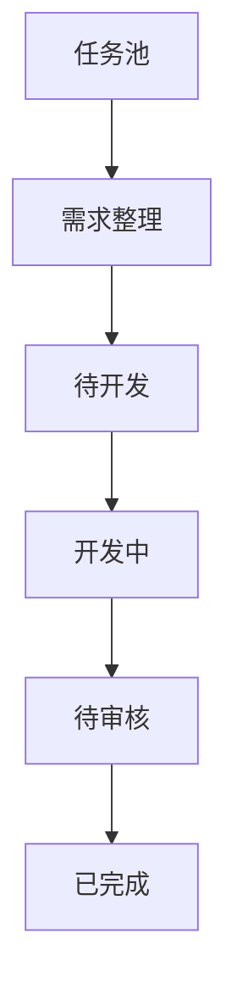

# BTaskAssistant

BTaskAssistant 是一个本地优先、人工把关的 AI 开发任务工作流助手。它负责把零散任务整理成可追溯、可确认、可执行、可审核的工作流，但不会替人做产品决策，也不会自动跳过任何阶段。

> 当前仓库已完成第一版可运行 MVP。可以直接从
> [GitHub Releases](https://github.com/blue7zz/BTaskAssistant/releases)
> 下载桌面版，也可以安装开发环境后从源码运行。

## 第一版包含什么

- 手动创建任务，或粘贴聊天记录导入任务。
- 使用接近 macOS 备忘录的富文本体验编辑任务正文；Markdown
  是持久化真相，可在富文本和源码模式间切换，并支持粘贴、拖放图片。
- 通过 Personal Access Token 从 Plane 项目分页收集工作项；固定脚本负责去重和保留原文。
  桌面端可用隔离的原生 PI RPC 提炼候选，任何候选仍必须人工确认后才能创建正式任务。
- 保存 Plane PAT 后自动发现工作区项目并以下拉框选择，不再要求手工查找或粘贴 Project UUID。
- 为任务保存原始说明、聊天记录、项目现状和文件内容等需求来源。
- 任务右侧工作台提供任务级原生 PI Session、增量消息历史、流式回答和停止操作；阶段 2 固定为无工具隔离模式。
- 需求访谈保留 PI 与 Codex 标识；PI 固定分析使用独立的无工具 utility Session，不与任务聊天历史混用。
- 访谈问题区分阻塞、重要和可选级别，支持回答、暂时跳过、排除范围、交叉复查和带风险强制推进。
- AI 草稿更新先作为候选展示，只有用户采纳后才进入带 `[S1]` 来源标记的实时需求草稿。
- 正式需求文档保留项目观察、用户确认记录、未确认事项和强制推进策略。
- 需求必须由人工确认并锁定，才能进入待开发阶段。
- 可选择 Codex 或原生 PI，复制已确认提示词并记录外部委托结果。
- 开发完成后生成固定审核清单，人工逐项检查、记录证据并确认通过。
- 所有任务状态只能手动推进或退回一个阶段。
- Wails 桌面模式把工作区数据保存在本机配置目录，并为每个任务维护独立的完整上下文目录；浏览器预览模式使用 `localStorage`。

## 核心状态机



每一个向前状态都有明确门禁：

| 进入阶段 | 必须满足 |
| --- | --- |
| 待开发 | 需求文档和提示词已生成；阻塞问题已回答或完成强制推进风险确认；且需求已人工批准 |
| 开发中 | 人工确认仍然有效 |
| 待审核 | 已记录开发完成结果 |
| 已完成 | 审核清单全部通过、已有审核记录，且人工确认审核通过 |

## 技术栈

- 桌面壳：Wails v2 + Go
- 前端：React 19 + TypeScript + Vite
- 状态：Zustand
- 本地数据：SQLite；浏览器模式回退到 `localStorage`
- AI 边界：`internal/engine` 固定分析与 `internal/agent` 原生 PI RPC 会话
- 富文本：MDXEditor（Markdown 原生）
- 外部来源：Plane REST API；PAT 保存在系统凭据库

## 运行

### 直接运行桌面版

- macOS：下载 `BTaskAssistant-macOS-universal.zip`，解压后双击 `BTaskAssistant.app`。
- Windows：下载 `BTaskAssistant-Windows-x64.zip`，解压后双击 `BTaskAssistant.exe`。

当前 MVP 尚未使用 Apple Developer 或 Windows 代码签名证书，因此首次启动可能出现系统安全提示。macOS 请右键应用并选择“打开”；Windows 请在 SmartScreen 中选择“更多信息 → 仍要运行”。

### 只运行前端

需要 Node.js 20 或更高版本。

```bash
cd frontend
pnpm install
pnpm dev
```

打开终端中显示的本地地址。浏览器模式可以人工走通完整工作流，数据保存在当前浏览器；PI 会话使用确定性 Mock，不启动本机 CLI，也不模拟物理 Session 文件。PI / Codex 真实分析需要 Wails 桌面客户端提供原生执行边界。

### 运行 Wails 桌面客户端

需要 Go 1.25+、Node.js 20+ 和 Wails v2。先按照 [Wails 官方安装说明](https://wails.io/docs/gettingstarted/installation) 配好对应平台的系统依赖，然后执行：

```bash
go install github.com/wailsapp/wails/v2/cmd/wails@latest
wails doctor
wails dev
```

构建桌面安装包：

```bash
wails build
```

首次执行 Go 命令时会下载模块依赖并生成 `go.sum`。桌面数据默认保存在系统用户配置目录下：SQLite 位于 `BTaskAssistant/database/btask.db`，每个任务在 `BTaskAssistant/tasks/<task-id>/` 中拥有独立目录，包含上下文快照以及从任务资料中落盘的文件和图片。任务资料根目录可在“设置 → 任务资料”中查看、打开或迁移到新的空目录；迁移成功后旧目录会保留为备份。

## 验证

```bash
cd frontend
pnpm typecheck
pnpm test
pnpm build
```

后端状态机测试在安装 Go 后执行：

```bash
go test ./internal/...
```

## 当前边界

桌面端会以严格 LF JSONL 启动 `pi --mode rpc`，用 `get_state` 完成启动探针，并把配置和 Session
隔离到当前任务的 `.btask` 目录；不会读取或复制 `~/.pi/agent`。阶段 2 的任务会话和固定 utility
分析均使用 `--no-tools`，不开放文件、Shell 或审批能力，也不会回退调用 `omp`。真实模型调用需要
显式凭据；无凭据只保证本机 PI 版本、进程和协议探针可用。Codex 需求访谈继续使用 `read-only`
沙箱。任何 AI 都不能批准需求或推进任务状态。

开发阶段仍采用复制已确认提示词、在外部执行并记录真实结果的方式。浏览器预览不启动本机 AI CLI。

Plane PAT 不写入 SQLite、前端状态或日志，而是保存到 macOS Keychain、Windows Credential
Manager 或 Linux Secret Service。远端 HTTP 地址会被拒绝，只有 HTTPS 和本机回环地址可以接收 PAT。

Plane 收集箱只要求两项连接信息：

- 服务地址：直接粘贴浏览器中的工作区地址，例如
  `https://plane.fymyriad.com/myriad/`
- Access Token：`plane_api_...`

连接成功后，客户端会自动识别工作区并列出可访问项目；用户只需从下拉框选择，
不再填写 Workspace slug、Project ID 或项目标识。Plane 的公开 PAT API
目前不能从实例根地址枚举工作区，因此服务地址需要包含工作区路径。PAT 只会
保存在运行客户端的这台电脑的系统凭据库；发布包和 Git 仓库不包含令牌。

详见 [完整目标架构](docs/SOFTWARE_ARCHITECTURE.md)、[MVP 落地架构](docs/ARCHITECTURE.md) 和 [第一版范围](docs/MVP_SCOPE.md)。
