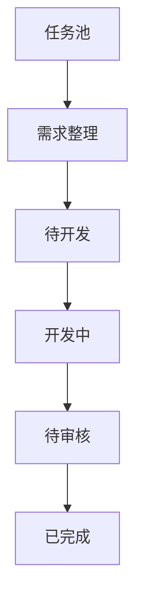

# BTaskAssistant

BTaskAssistant 是一个本地优先、人工把关的 AI 开发任务工作流助手。它负责把零散任务整理成可追溯、可确认、可执行、可审核的工作流，但不会替人做产品决策，也不会自动跳过任何阶段。

> 当前仓库已完成第一版可运行 MVP。前端可以独立在浏览器中运行；安装 Go 与 Wails v2 后可作为桌面客户端运行。

## 第一版包含什么

- 手动创建任务，或粘贴聊天记录导入任务。
- 为任务保存原始说明、聊天记录、项目现状和文件内容等需求来源。
- 通过固定模板生成带 `[S1]` 来源标记的需求文档候选稿与开发提示词。
- 明确目标、范围内、范围外、验收标准、风险和待确认问题。
- 需求必须由人工确认并锁定，才能进入待开发阶段。
- 可选择 Codex 或 PI / oh-my-pi，复制已确认提示词并记录外部委托结果。
- 开发完成后生成固定审核清单，人工逐项检查、记录证据并确认通过。
- 所有任务状态只能手动推进或退回一个阶段。
- Wails 桌面模式把工作区数据保存在本机配置目录；浏览器预览模式使用 `localStorage`。

## 核心状态机



每一个向前状态都有明确门禁：

| 进入阶段 | 必须满足 |
| --- | --- |
| 待开发 | 需求文档和提示词已生成，所有问题已回答，且人工确认 |
| 开发中 | 人工确认仍然有效 |
| 待审核 | 已记录开发完成结果 |
| 已完成 | 审核清单全部通过、已有审核记录，且人工确认审核通过 |

## 技术栈

- 桌面壳：Wails v2 + Go
- 前端：React 19 + TypeScript + Vite
- 状态：Zustand
- 本地数据：SQLite；浏览器模式回退到 `localStorage`
- AI 边界：`internal/engine.Adapter`

## 运行

### 只运行前端

需要 Node.js 20 或更高版本。

```bash
cd frontend
pnpm install
pnpm dev
```

打开终端中显示的本地地址。浏览器模式已经能走通完整工作流，数据保存在当前浏览器。

### 运行 Wails 桌面客户端

需要 Go 1.23.3+、Node.js 20+ 和 Wails v2。先按照 [Wails 官方安装说明](https://wails.io/docs/gettingstarted/installation) 配好对应平台的系统依赖，然后执行：

```bash
go install github.com/wailsapp/wails/v2/cmd/wails@latest
wails doctor
wails dev
```

构建桌面安装包：

```bash
wails build
```

首次执行 Go 命令时会下载模块依赖并生成 `go.sum`。桌面数据保存在系统用户配置目录下的 `BTaskAssistant/database/btask.db`。

## 验证

```bash
cd frontend
pnpm typecheck
pnpm test
pnpm build
```

后端状态机测试在安装 Go 后执行：

```bash
go test ./internal/...
```

## 当前边界

第一版没有猜测 PI、oh-my-pi 或 Codex 的本机 CLI 协议，因此不会直接启动 AI 进程。当前做法是生成并复制已经人工确认的提示词，在外部完成委托后把真实结果记录回来。接口边界已经预留，后续只有在 CLI 调用协议、权限、工作目录和失败处理都确认后才会启用自动执行。

详见 [完整目标架构](docs/SOFTWARE_ARCHITECTURE.md)、[MVP 落地架构](docs/ARCHITECTURE.md) 和 [第一版范围](docs/MVP_SCOPE.md)。
