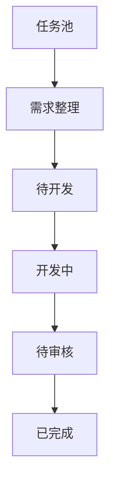

# BTaskAssistant

BTaskAssistant 是一个本地优先、人工把关的 AI 开发任务工作流助手。它负责把零散任务整理成可追溯、可确认、可执行、可审核的工作流，但不会替人做产品决策，也不会自动跳过任何阶段。

> 当前仓库已完成第一版可运行 MVP。可以直接从
> [GitHub Releases](https://github.com/blue7zz/BTaskAssistant/releases)
> 下载桌面版，也可以安装开发环境后从源码运行。

## 第一版包含什么

- 手动创建任务，或粘贴聊天记录导入任务。
- 使用接近 macOS 备忘录的富文本体验编辑任务正文；Markdown
  是持久化真相，可在富文本和源码模式间切换，并支持粘贴、拖放图片。
- 通过 Personal Access Token 从 Plane 项目分页收集工作项；固定脚本负责去重和保留原文。
  桌面端可用隔离的原生 PI RPC 提炼候选，任何候选仍必须人工确认后才能创建正式任务。
- 保存 Plane PAT 后自动发现工作区项目并以下拉框选择，不再要求手工查找或粘贴 Project UUID。
- 为任务保存原始说明、聊天记录、项目现状和文件内容等需求来源。
- 任务右侧工作台提供任务级原生 PI Session、分页历史、流式回答、Steer、Follow-up、停止与显式恢复；切换任务时会清空旧页面状态并拒绝跨任务事件。
- Ask / Plan / Agent 使用 BTask 自有工具和权限门禁；上下文、附件、产物、权限、运行记录及 Git worktree 均按任务隔离。
- 需求访谈保留 PI 与 Codex 标识；PI 固定分析使用独立的无工具 utility Session，不与任务聊天历史混用。
- 访谈问题区分阻塞、重要和可选级别，支持回答、暂时跳过、排除范围、交叉复查和带风险强制推进。
- AI 草稿更新先作为候选展示，只有用户采纳后才进入带 `[S1]` 来源标记的实时需求草稿。
- 正式需求文档保留项目观察、用户确认记录、未确认事项和强制推进策略。
- 需求必须由人工确认并锁定，才能进入待开发阶段。
- 可选择 Codex 或原生 PI，复制已确认提示词并记录外部委托结果。
- 开发完成后生成固定审核清单，人工逐项检查、记录证据并确认通过。
- 所有任务状态只能手动推进或退回一个阶段。
- Wails 桌面模式把工作区数据保存在本机配置目录，并为每个任务维护独立的完整上下文目录；浏览器预览模式使用 `localStorage`。

## 核心状态机



每一个向前状态都有明确门禁：

| 进入阶段 | 必须满足 |
| --- | --- |
| 待开发 | 需求文档和提示词已生成；阻塞问题已回答或完成强制推进风险确认；且需求已人工批准 |
| 开发中 | 人工确认仍然有效 |
| 待审核 | 已记录开发完成结果 |
| 已完成 | 审核清单全部通过、已有审核记录，且人工确认审核通过 |

## 技术栈

- 桌面壳：Wails v2 + Go
- 前端：React 19 + TypeScript + Vite
- 状态：Zustand
- 本地数据：SQLite；浏览器模式回退到 `localStorage`
- AI 边界：`internal/engine` 固定分析与 `internal/agent` 原生 PI RPC 会话
- 富文本：MDXEditor（Markdown 原生）
- 外部来源：Plane REST API；PAT 保存在系统凭据库

## 运行

### 直接运行桌面版

- macOS：下载 `BTaskAssistant-macOS-universal.zip`，解压后双击 `BTaskAssistant.app`。
- Windows：下载 `BTaskAssistant-Windows-x64.zip`，解压后双击 `BTaskAssistant.exe`。

当前 MVP 尚未使用 Apple Developer 或 Windows 代码签名证书，因此首次启动可能出现系统安全提示。macOS 请右键应用并选择“打开”；Windows 请在 SmartScreen 中选择“更多信息 → 仍要运行”。

### 只运行前端

需要 Node.js 20 或更高版本。

```bash
cd frontend
pnpm install
pnpm dev
```

打开终端中显示的本地地址。浏览器模式可以人工走通完整工作流，数据保存在当前浏览器；PI 会话使用确定性 Mock，不启动本机 CLI，也不模拟物理 Session 文件。PI / Codex 真实分析需要 Wails 桌面客户端提供原生执行边界。

### 运行 Wails 桌面客户端

需要 Go 1.25+、Node.js 20+ 和 Wails v2。先按照 [Wails 官方安装说明](https://wails.io/docs/gettingstarted/installation) 配好对应平台的系统依赖，然后执行：

```bash
go install github.com/wailsapp/wails/v2/cmd/wails@latest
wails doctor
wails dev
```

构建桌面安装包：

```bash
wails build
```

首次执行 Go 命令时会下载模块依赖并生成 `go.sum`。桌面数据默认保存在系统用户配置目录下：SQLite 位于 `BTaskAssistant/database/btask.db`，每个任务在 `BTaskAssistant/tasks/<task-id>/` 中拥有独立目录，包含上下文快照以及从任务资料中落盘的文件和图片。任务资料根目录可在“设置 → 任务资料”中查看、打开或迁移到新的空目录；迁移成功后旧目录会保留为备份。

## 验证

```bash
cd frontend
pnpm typecheck
pnpm test
pnpm build
```

后端状态机测试在安装 Go 后执行：

```bash
go test ./internal/...
```

## 当前边界

桌面端使用已验证的原生 PI `0.82.x`，以严格 LF JSONL 启动 `pi --mode rpc`，用 `get_state`
和 BTask gate 心跳完成启动探针。Session、上下文、运行日志和受控产物都位于当前任务目录；
默认配置同样按任务隔离。用户可在 PI 设置中显式选择读取本机 `PI_CODING_AGENT_DIR`（默认
`~/.pi/agent`）的模型与 provider 登录，但不会复制凭据。启动参数始终关闭全局扩展、技能、
提示词模板、主题、上下文自动发现、内建工具和在线包发现，也不会回退调用 `omp`。

PI 仅能调用 BTask 显式注册的任务资源、artifact、worktree 和 Shell 工具。Go 后端校验
task/session/run、模式、任务状态、nonce、路径和授权回执；未知工具、门禁失效、越界路径和隐藏的
Git push/发布动作失败关闭。该机制是应用级软边界，不是操作系统沙箱；PI 与工具仍以当前用户权限
运行。任何 AI 都不能批准需求、推进任务状态、自动提交、自动推送、创建 PR、合并或发布。

工具输出摘要进入 SQLite，较大正文写入任务运行目录并按需读取；当前完整工具输出落盘上限为
12 MiB，UI 单次懒加载最多 2 MiB。浏览器预览使用确定性 Mock，不启动本机 AI CLI。

Plane PAT 不写入 SQLite、前端状态或日志，而是保存到 macOS Keychain、Windows Credential
Manager 或 Linux Secret Service。远端 HTTP 地址会被拒绝，只有 HTTPS 和本机回环地址可以接收 PAT。

Plane 收集箱只要求两项连接信息：

- 服务地址：直接粘贴浏览器中的工作区地址，例如
  `https://plane.fymyriad.com/myriad/`
- Access Token：`plane_api_...`

连接成功后，客户端会自动识别工作区并列出可访问项目；用户只需从下拉框选择，
不再填写 Workspace slug、Project ID 或项目标识。Plane 的公开 PAT API
目前不能从实例根地址枚举工作区，因此服务地址需要包含工作区路径。PAT 只会
保存在运行客户端的这台电脑的系统凭据库；发布包和 Git 仓库不包含令牌。

详见 [完整目标架构](docs/SOFTWARE_ARCHITECTURE.md)、[MVP 落地架构](docs/ARCHITECTURE.md)、
[PI Agent 工作台](docs/PI_AGENT_WORKBENCH.md)、[权限边界](docs/PERMISSIONS.md)、
[数据迁移](docs/DATA_MIGRATION.md) 和 [第一版范围](docs/MVP_SCOPE.md)。

## Reasonix 工作台（RX）

任务详情的 `记录 / PI / RX` 标签页内嵌完整 DeepSeek-Reasonix 界面
（源码 1:1 位于 `reasonix-app/`，Go 内核经 `reasonix-bridge/` 同进程融合）。

**一个任务 = 一个 Reasonix 会话**：每个任务的会话 JSONL、检查点、事件流与
记忆/技能数据按 taskId 隔离在应用数据目录（`~/Library/Application Support/
BTaskAssistant/tasks/<taskId>/reasonix-sessions/`），离开任务详情页释放运行时，
会话文件保留可恢复。

Reasonix 的工作目录固定为该任务自己的文件空间
（`.../BTaskAssistant/tasks/<taskId>/`），无需先绑定 Git 仓库。若任务另外创建了
Git worktree，它仍位于任务空间的 `repos/` 下，由“变更”面板独立管理。

功能：真实模型对话（复用本机 reasonix 配置/凭据）、历史（分页/回滚/分支/
压缩）、模型与推理强度切换、ask 提问卡与工具审批、目标/计划模式、记忆与技能
面板、会话重命名/删除（含侧车清理）、↑/↓ 提示历史。

构建：`wails build` 单命令（prebuild 自动构建 reasonix 前端）。验证：
`go test ./...`、`cd frontend && pnpm test`、`cd reasonix-app/desktop/frontend && pnpm test`。

**开发模式注意**：`wails dev`（vite 开发服务器）下 `/reasonix/` 前缀由主应用
asset server 提供，但 reasonix dist 由 `pnpm build`（prebuild）产出——若开发
中改了 reasonix 前端，请先 `cd reasonix-app/desktop/frontend && pnpm build`
再刷新 RX 标签；生产构建 `wails build` 会自动完成这一步。

**运行时自检**：`BTA_RX_SELFCHECK=1 ./BTaskAssistant`（或 `go run .`）跳过
UI 直接验证 RX 内核链路（会话构建/新会话/提交/事件流），返回退出码——
无需打开应用即可确认融合内核可用，已纳入 `scripts/test-all.sh`。

**VITE_REASONIX_URL 约束**：该环境变量只可配置**同源路径**前缀（默认
`/reasonix/`）。ReasonixPage 桥按同源校验消息来源——指向跨源 dev server
（如 `http://localhost:5173`）会导致全部桥调用被安全拒绝；开发 reasonix
前端请按上文先 `pnpm build` 再刷新。

**更新逻辑**：Reasonix 前端在宿主（RX）环境下不包含更新机制——`UpdaterProvider`
host 模式直接提供"已是最新"（check/download/install 全 no-op）、设置面板无
"更新"标签、`UpdateBanner` 不挂载、`CheckUpdate` 绑定参数为 `any`（杜绝参数
解析错误）。此前"更新失败：error parsing arguments"源于旧版 `CheckUpdate(bool)`
签名与前端 `channel: string` 契约不匹配，已修复并全路径验证（更新调用 0 次）。
