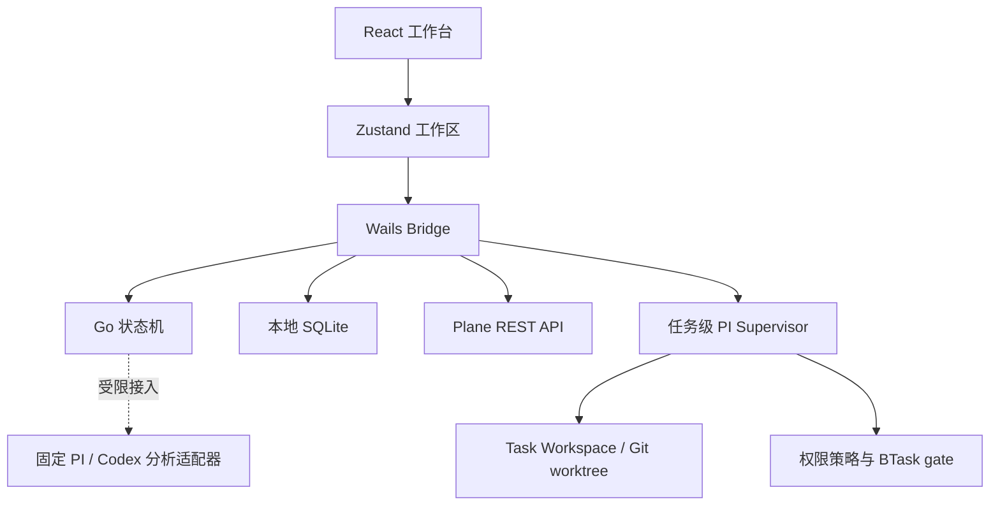

# BTaskAssistant 第一版架构

本文描述当前可运行纵向切片。长期分层、完整领域模型和实施阶段以 [`SOFTWARE_ARCHITECTURE.md`](SOFTWARE_ARCHITECTURE.md) 为准。

## 设计目标

第一版优先保证四件事：

1. 任务可以真实保存并恢复。
2. 所有状态只能由用户手动流转。
3. 需求内容有来源、缺失项显式暴露、未经确认不能开发。
4. PI 与 Codex 的执行协议不会渗透到任务状态和产品规则中。

## 结构



| 层 | 位置 | 职责 |
| --- | --- | --- |
| 视图 | `frontend/src/components` | 任务录入、需求整理、开发记录、审核交互 |
| 前端领域 | `frontend/src/domain` | 数据结构、访谈输入包、需求模板、浏览器回退状态机 |
| 状态 | `frontend/src/store` | 任务操作、确认失效规则、持久化 |
| 本机桥接 | `app.go`、`frontend/src/lib/bridge.ts` | 状态读写、原生门禁、引擎状态 |
| Go 领域 | `internal/workflow` | 桌面端最终状态转换校验 |
| 存储 | `internal/storage` | SQLite 初始化、迁移、工作区快照与任务上下文目录 |
| AI 边界 | `internal/engine` | PI / Codex 结构化需求分析、只读权限和配置状态 |
| Agent 会话 | `internal/agent` | 原生 PI RPC、Session、稳定事件、恢复、资源和门禁编排 |
| 任务空间 | `internal/taskspace` | 每任务目录、附件、产物、旧数据迁移和路径安全 |
| 权限与执行 | `internal/permissions`、`internal/execution` | 能力分类、授权作用域、受控 Shell 和进程停止 |
| Git 隔离 | `internal/gitrepo` | 仓库绑定、独立 worktree、状态和有界 Diff |
| 外部收集 | `internal/plane` | HTTPS、PAT 鉴权、分页、去重前标准化 |
| 凭据 | `internal/credentials` | 系统凭据库；令牌不进入 SQLite |

## 富文本与 Markdown

任务正文使用 MDXEditor。编辑器直接接收和输出 Markdown，不通过 HTML
作为中间持久化格式；现有纯文本任务天然兼容。支持富文本、Markdown
源码、表格、链接和图片，单张本地图片限制为 4 MB，并以 data URL
随本地工作区和对应任务的 `context.json` 保存。后续资料存储规范化时，
再迁移为任务目录中的独立资料文件。

## Plane 收集箱

Plane 集成按两层处理：

1. Go 固定脚本使用 `X-API-Key` 调用 REST API，负责 HTTPS 校验、分页、去重、字段标准化和原文保留。
2. 本机原生 PI 仅在用户点击时，以隔离的无工具 utility Session 提炼标题、正文、关键信息和待确认问题。

连接配置只暴露工作区页面地址和 PAT。后端从 URL 提取 workspace slug，
鉴权成功后返回项目列表供用户选择；内部 UUID 不要求手填。PAT 按 Plane
实例存入系统凭据库，并兼容迁移 v0.2.1 的旧凭据键。

候选状态只有 `pending`、`accepted`、`ignored`。只有用户点击
“人工确认并转为任务”才会创建正式任务；Plane 原始内容会作为独立、
不可被 AI 覆盖的需求来源保存。

## 数据与确认规则

- 新建任务时，用户输入的原始说明会直接保存为第一条来源，不被改写。
- 聊天导入会保留完整原文，并明确标记为 `chat` 来源。
- 需求访谈输入包只包含当前任务、用户选择的资料、历史回答、开放问题和当前需求版本。
- AI 返回的需求事实必须引用有效来源 ID；没有来源的内容不会进入已确认事实。
- 代码中发现的现状单独保存为 `PROJECT_OBSERVATION`，不能自动转成用户需求。
- 每轮最多加入 5 个新问题；已回答或语义重复的问题不会再次创建。
- 缺少项目、验收标准或来源时，固定模板仍只生成待确认问题，不会补造答案。
- AI 的草稿更新先保存在建议区，用户采纳后才合并到实时草稿。
- 强制推进必须为每个未解决问题保存处理策略，正式文档和开发提示词都会保留这些限制。
- 任何来源或需求字段变更都会清空旧的文档与提示词，用户必须重新生成。
- 人工确认后需求进入锁定状态；只有显式撤销确认后才能修改。
- 每次人工批准都会追加保存文档和执行提示词快照；撤销批准后创建的新草稿不会覆盖旧快照。
- 后续状态只读取确认快照，不允许 AI 回写产品决策。

## 本地持久化

桌面客户端通过 Go 写入：

```text
<UserConfigDir>/BTaskAssistant/
├── database/
│   └── btask.db
└── tasks/
    └── <task-id>/
        ├── .btask/
        │   ├── manifest.json
        │   ├── resources.json
        │   ├── pi-agent/
        │   └── pi-sessions/
        ├── context/
        ├── sources/
        ├── attachments/
        ├── artifacts/
        ├── repos/
        └── runs/
```

完整前端工作区仍保存在 `workspace_state` 的版本化 JSON 字段中；PI 工作台的
workspace、resource、session、message、event、run、tool、permission、Git binding、
artifact 和 requirement proposal 使用 schema v5 的规范化表。SQLite 是状态恢复真相；
任务目录保存可读上下文、不可变来源、附件、PI Session、运行日志、工具大输出和产物。
旧 `context.json`、`files/`、`images/` 采用 copy-first 方式迁移并继续保留，不会被自动删除。

`projectPath` 仍只引用用户选择的代码仓库，不会把仓库复制到任务目录；PAT、
Token 等凭据也不进入任务目录。移入回收站、恢复、永久删除任务以及清空工作区
都不会自动删除任务目录，避免误删用户补充的资料；不再被 SQLite 引用的目录
保留为本地归档。

任务资料根目录默认是 `<UserConfigDir>/BTaskAssistant/tasks`，可在设置中查看、
打开或迁移到用户选择的新空目录。迁移会复制包括用户文件在内的完整目录，验证
并重新生成当前任务上下文后才切换 SQLite 配置；失败时继续使用旧目录，成功后
旧目录也保留为备份。应用启动时会根据 SQLite 幂等补建或修复当前任务的应用管理
文件。浏览器预览没有 Wails Bridge，因而只回退到 `localStorage`，不提供物理
任务目录。

## AI 与 Agent 边界

`internal/engine.Adapter` 和结构化 `RequirementAnalyzer` 负责固定的一次性分析；
`internal/agent.Service` 负责右侧任务级 Agent 工作台。收集和需求访谈使用固定 JSON 输入包：

- PI utility Session 关闭扩展、技能、上下文自动发现和工具，不与任务聊天 Session 混用。
- Codex 使用临时会话和 `read-only` 沙箱。
- 用户补充的 PNG、JPEG、WebP 和 GIF 会从本地 data URL 提取成临时只读附件，分析结束后立即删除。
- 未绑定本地目录时，两者只分析用户选择的资料。
- 原生调用统一限制输入、输出和三分钟超时；失败只会把访谈标记为受阻。

任务级 Agent 只启动原生 `pi --mode rpc`。Supervisor 关闭 PI 的全局扩展、技能与内建工具，
显式加载由应用内嵌并校验的 BTask gate Extension；默认使用任务级配置目录，只有用户选择
`explicit-inherit` 后才读取本机 PI 的模型与 provider 登录。稳定事件先落 SQLite，再进入有界
Wails 队列。Ask、Plan、Agent 的工具集合、任务状态、路径与授权由 Go 判断，React 只展示。

每个详情页以 `taskId` 作为最外层上下文边界：Session、消息、引用、权限、工具、运行、
worktree 和异步响应必须同时匹配当前 task/session。切换任务会取消订阅并清空上一任务的
组件状态，迟到事件和迟到请求结果会被丢弃。Agent 完成或测试通过不会改变任务主状态。

这是应用级软边界：PI、Extension、Git 和 Shell 仍使用当前操作系统用户权限。第一版不开放
自动提交、push、PR、合并、发布、多 Agent 并行或跨任务全局记忆。

## Reasonix 工作台（RX 标签页）

任务详情 `记录 / PI / RX` 的 RX 标签是 DeepSeek-Reasonix 的完整融合：
一个任务 = 一个 Reasonix 会话。

### 结构

- `reasonix-app/`：Reasonix 完整源码（前端 React 1:1 + Go 内核，module `reasonix`，
  BTask `go.mod` 以 `replace reasonix => ./reasonix-app` 引用内核）。
- `reasonix-bridge/`：wrapper module（module 名 `reasonix/bridge`，满足 Go internal
  规则），提供 `Manager`：taskId → 独立控制器（`boot.Build`）+ 任务隔离会话目录
  （`<BTask 数据目录>/tasks/<taskId>/reasonix-sessions/`）+ 事件转发回调。
- `rx_bindings.go`：BTask 绑定层。tabID ↔ taskId 映射，~90 个 reasonix 前端同名
  绑定方法（会话/消息/模型/历史/检查点/审批/启动路径），工作区路径穿越与
  会话删除边界校验。
- `frontend/src/components/ReasonixPage.tsx`：完全嵌入容器（无 iframe）。reasonix
  前端源码经动态 import 纳入 BTask 同一 vite 构建（独立懒加载 chunk），渲染在
  宿主 div 的 shadow root 内——36k 行全局深色 CSS 经 `:host` 改写后注入 shadow
  （`html`/`body`/`:root` 元素选择器改写为 `:host`，注释保护），与宿主 DOM/样式
  双向隔离。绑定调用经 `bridge.ts` embed 分支直连 `window.go.main.App`（同
  document，无 postMessage）；内核事件直连 `window.runtime` 订阅 `reasonix:event`。
  任务切换保留控制器（秒开），离开详情页时释放（会话文件保留）。
- 构建：`wails build` 单命令产出全量（reasonix 源码直接打包，无需独立 dist；
  独立应用构建脚本 `scripts/build-reasonix-frontend.sh` 保留）。

### 宿主契约与运行时（阶段 1 收敛）

- **契约校验**：`internal/reasonix/contract_test.go` 从 reasonix 前端
  `AppBindings`（bridge.ts）与宿主绑定源码自动校验方法名与参数数量——
  签名漂移（假兼容根源）在 CI 即失败；当前 358 个契约方法全部有宿主绑定
  且参数数一致（尾逗号/函数类型参数已处理）。
- **ActivateReasonixTask(taskId, workspaceRoot, title, requestSeq)**：序号
  原子激活——只有最新请求能成为活动任务；同任务乱序（旧序号晚到）拒绝
  （ErrStaleActivate）；不同任务可并行建立控制器（后台保活基础）。
  标题在控制器构建前即保存（首次打开不丢）；重复激活保留 model/effort/
  token 覆盖值。
- **build-then-swap**：SetModel 先构建新控制器并恢复原会话，成功后才原子
  替换，最后关闭旧控制器——构建失败时旧会话继续可用（原实现先关旧控制器，
  失败即毁掉会话）。
- **假实现收敛**：核心 stub（对话框/Provider/MCP 等 48 个）改为显式错误
  （"Reasonix 宿主未实现"），不再返回假成功；Memory 读类（Memory/
  MemorySuggestions/MemoryRevisions）接入内核真实数据。
- **测试隔离**：TestMain 设置临时 REASONIX_HOME——不读取本机真实配置、
  不消耗真实 API 额度；`go test -race` 无竞态。

### 事件流

内核控制器事件 → `reasonix-bridge` sink → BTask `wailsruntime.EventsEmit(
"reasonix:event", wirePayload)` → reasonix 前端 `onEvent` 直连订阅（wire 形状
与桌面端 `agent:event` 完全一致）。

### 会话模型

会话为 JSONL 文件（内核 `agent.NewSessionPath` 命名），侧车含检查点/事件流/
恢复文件。历史列表、恢复、提示历史（↑/↓）等按前端 `types.ts` 契约输出
（preview/turns/unix ms 时间戳/current 标记）。模型切换经内核
`AdoptHistory` 重建控制器续写同一会话文件。

### 持久化与数据面（23 轮审查后的最终形态）

- **读写两侧对齐内核存储**：回合结束（turn_done）时宿主触发 `ctrl.Snapshot()`（
  与桌面端 tabEventSink 同约定），关闭/退出时等待 in-flight 快照落盘（对应
  桌面端 quiesceTabAutosave）；历史读取经 `agent.LoadSession` 重放 native
  事件日志（主 .jsonl 是滞后快照，直接读会丢最新回合），失败回退 JSON 解析。
- **删除**：主文件 + 11 类侧车（.events.jsonl/.ckpt/.goal-state.json/
  .recovery.json/.meta/.jobs 等）全清，标题侧车条目同步移除。
- **会话保留**：关闭/离开任务时把最后活跃会话路径持久化到
  `last-session.txt`；控制器重建（切回任务）时自动恢复该会话续写。
- **上限清理**：每任务最多保留 `MaxSessionsPerTask`（10）个会话；新建
  会话后按最后使用时间（mtime）清理最旧会话（含全部侧车），当前激活
  会话始终保留。
- **历史**：分页契约完整（startTurn/endTurn/totalTurns/hasOlder + beforeTurn
  向前翻页），Rewind/Fork/SummarizeFrom/SummarizeUpTo 直通内核。
- **数据面板**：记忆（docs/facts/storeDir）、技能（enabled 状态）、模型
  （Current 标记）、设置（SettingsView 最小完整结构）均来自内核真实数据。

### 测试矩阵

- BTask：`go test ./...`（12 包，含 reasonix 集成/契约/安全测试：会话生命周期、
  任务隔离、多轮+模型切换、历史分页、标题侧车、路径穿越、任意删除、消息源校验、
  fork 激活、删除轮换、无配置降级、effort 切换）。
- BTask 前端：127 测试 + typecheck（含 ReasonixPage embed 4 项：shadow 挂载/
  任务切换重挂载/卸载释放/失败降级）。
- reasonix 前端：94 套件测试 + typecheck + bundle 预算。
- 调用面零未绑定（reasonix 前端全部 `app.*` 调用均有绑定或合理默认）。
- 运行时自检：`BTA_RX_SELFCHECK=1`（真实进程内验证 RX 内核链路，纳入
  `scripts/test-all.sh`）。

### 设计边界（PI 与 RX 的工作区共享）

任务详情内 PI 工作台与 RX 标签使用**同一任务工作区**（`store.EnsureTaskWorkspace`
的 RootPath）：PI 是 BTask 受控工具，RX 是 reasonix 内核（自带工具链，可读写
工作区文件）。两者并发使用同一工作区时，reasonix 的编辑工具与 PI 的编辑
可能产生文件级冲突——reasonix 会话文件有内核文件租约保护，但工作区文件本身
无跨运行时锁。建议同一任务避免同时运行 PI 回合与 RX 回合；会话数据（JSONL/
检查点/记忆）始终隔离在任务专属目录，不受影响。
