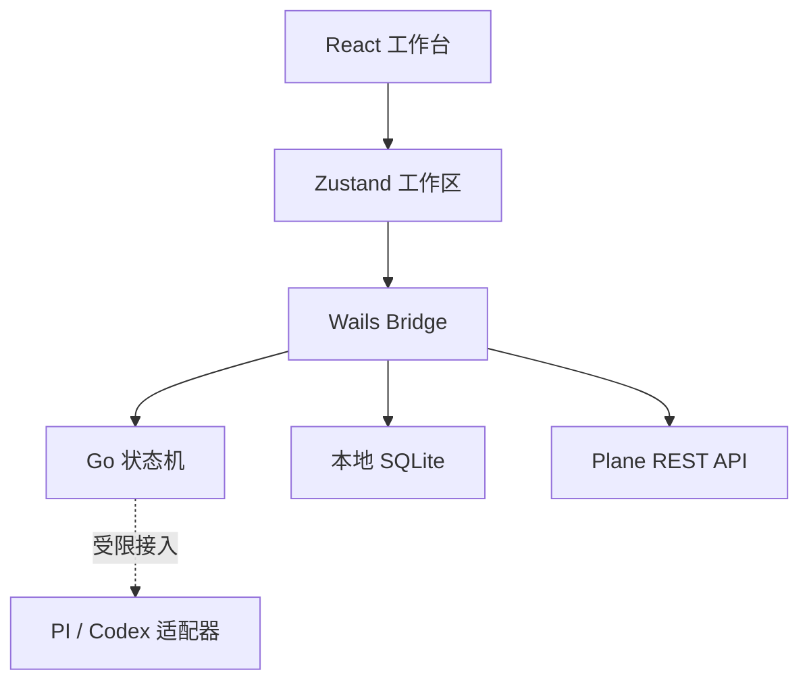

# BTaskAssistant 第一版架构

本文描述当前可运行纵向切片。长期分层、完整领域模型和实施阶段以 [`SOFTWARE_ARCHITECTURE.md`](SOFTWARE_ARCHITECTURE.md) 为准。

## 设计目标

第一版优先保证四件事：

1. 任务可以真实保存并恢复。
2. 所有状态只能由用户手动流转。
3. 需求内容有来源、缺失项显式暴露、未经确认不能开发。
4. PI 与 Codex 的执行协议不会渗透到任务状态和产品规则中。

## 结构



| 层 | 位置 | 职责 |
| --- | --- | --- |
| 视图 | `frontend/src/components` | 任务录入、需求整理、开发记录、审核交互 |
| 前端领域 | `frontend/src/domain` | 数据结构、固定需求模板、浏览器回退状态机 |
| 状态 | `frontend/src/store` | 任务操作、确认失效规则、持久化 |
| 本机桥接 | `app.go`、`frontend/src/lib/bridge.ts` | 状态读写、原生门禁、引擎状态 |
| Go 领域 | `internal/workflow` | 桌面端最终状态转换校验 |
| 存储 | `internal/storage` | SQLite 初始化、迁移与工作区快照 |
| AI 边界 | `internal/engine` | PI / Codex 统一接口与配置状态 |
| 外部收集 | `internal/plane` | HTTPS、PAT 鉴权、分页、去重前标准化 |
| 凭据 | `internal/credentials` | 系统凭据库；令牌不进入 SQLite |

## 富文本与 Markdown

任务正文使用 MDXEditor。编辑器直接接收和输出 Markdown，不通过 HTML
作为中间持久化格式；现有纯文本任务天然兼容。支持富文本、Markdown
源码、表格、链接和图片，单张本地图片限制为 4 MB，并以 data URL
随本地工作区保存。后续资料存储规范化时，再迁移到内容寻址文件目录。

## Plane 收集箱

Plane 集成按两层处理：

1. Go 固定脚本使用 `X-API-Key` 调用 REST API，负责 HTTPS 校验、分页、去重、字段标准化和原文保留。
2. 本机 OMP 仅在用户点击时，以无工具模式提炼标题、正文、关键信息和待确认问题。

候选状态只有 `pending`、`accepted`、`ignored`。只有用户点击
“人工确认并转为任务”才会创建正式任务；Plane 原始内容会作为独立、
不可被 AI 覆盖的需求来源保存。

## 数据与确认规则

- 新建任务时，用户输入的原始说明会直接保存为第一条来源，不被改写。
- 聊天导入会保留完整原文，并明确标记为 `chat` 来源。
- 固定模板只提取每条来源的首个有效文本片段作为事实摘要，并附上 `[Sx]`。
- 缺少项目、验收标准或来源时，模板只生成待确认问题。
- 任何来源或需求字段变更都会清空旧的文档与提示词，用户必须重新生成。
- 人工确认后需求进入锁定状态；只有显式撤销确认后才能修改。
- 后续状态只读取确认快照，不允许 AI 回写产品决策。

## 本地持久化

桌面客户端通过 Go 写入：

```text
<UserConfigDir>/BTaskAssistant/database/btask.db
```

第一版先把完整工作区保存到 `workspace_state` 的版本化 JSON 字段中，并启用 WAL、外键和写入等待。这样桌面模式从第一天就以 SQLite 为持久化真相；后续按 `SOFTWARE_ARCHITECTURE.md` 把 Task、RequirementRevision、ExecutionRun 等逐步拆成规范表时，可以通过迁移完成而不改变前端存储入口。浏览器预览没有 Wails Bridge，因此自动回退到 `localStorage`。

## AI 适配器策略

`internal/engine.Adapter` 是唯一允许接入 PI 或 Codex 的接口。收集阶段允许
OMP 在无工具模式下做候选提炼；开发执行仍未启用，因为以下信息尚未完成：

- 完整 OMP RPC 事件、工具审批与恢复协议；
- Codex 的具体委托与恢复方式；
- 项目工作目录、权限和环境变量边界；
- 中断、超时、失败重试和进程恢复规则；
- 输出如何映射为可信的开发结果或审核证据。

这些内容确认前，开发工作台只提供“复制确认提示词”和“记录真实结果”。
