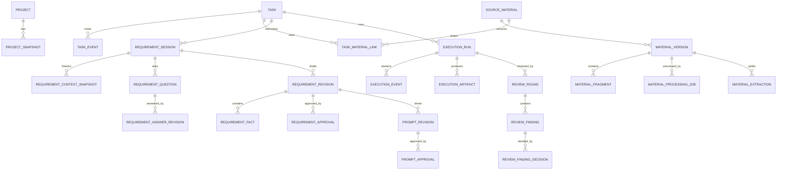

# BTaskAssistant 数据模型

> 状态：逻辑模型 v1.0  
> 日期：2026-07-28  
> 本文定义实体、关系和不变量；具体 SQLite DDL、驱动和迁移工具需在实施任务中批准。

## 1. 建模原则

- `Task` 是工作流聚合根，但资料、需求、运行和审查各自保留生命周期。
- 原件、回答、需求、提示词、运行和审查采用追加/版本化记录，不覆盖历史。
- 每个写命令具有 `command_id`、`expected_version`、actor 和时间。
- 所有时间以 UTC 保存，UI 按本地时区显示。
- ID 使用应用生成的不可猜测稳定 ID；具体 UUID/ULID 方案在实现时确定。
- 结构化 AI 输出必须同时保存 schema 版本、规范化结果和受控原始产物引用。
- 数据库不保存密钥，只保存系统凭据库中的不透明引用。
- 本地应用数据不得包含长期项目源码检出。

## 2. 聚合关系



## 3. 项目与源码快照

### 3.1 `projects`

```yaml
id: string
name: string
repository_provider: GITHUB
repository_full_name: string
default_branch: string
default_execution_location: REMOTE_WORKSPACE | LOCAL_EPHEMERAL | EXISTING_LOCAL | MANUAL_HANDOFF
existing_local_path: string?          # 仅显式本地模式
source_retention_policy: json
active: boolean
version: integer
created_at: timestamp
updated_at: timestamp
```

### 3.2 `project_rules`

保存允许/禁止路径、AGENTS 文件引用、技术栈和风险规则。规则本身版本化，执行包引用具体版本。

### 3.3 `project_commands`

```yaml
id: string
project_id: string
kind: FORMAT | STATIC_CHECK | UNIT_TEST | INTEGRATION_TEST | BUILD | RUN
label: string
command: string
working_directory: string
timeout_seconds: integer
network_required: boolean
active: boolean
```

命令是用户/项目规则批准的候选验证，不代表每次都安全执行；运行时仍做权限审批。

### 3.4 `project_snapshots`

```yaml
id: string
project_id: string
repository_full_name: string
revision_sha: string
branch_hint: string?
rule_version: integer
evidence_manifest: json
created_by: string
created_at: timestamp
```

`revision_sha` 必填。远端分支名称仅为提示，不能替代不可变 SHA。

## 4. 任务与事件

### 4.1 `tasks`

```yaml
id: string
title: string
original_description: text
status: TaskStatus
priority: LOW | NORMAL | HIGH | URGENT
project_id: string?
current_requirement_revision_id: string?
approved_requirement_revision_id: string?
approved_prompt_revision_id: string?
active_run_id: string?
blocked_from_state: TaskStatus?
blocked_reason_code: string?
version: integer
created_at: timestamp
updated_at: timestamp
archived_at: timestamp?
```

`tasks` 只保存当前指针和便于查询的状态；历史来自不可变 revision、run 和 event。

### 4.2 `task_events`

```yaml
id: string
task_id: string
sequence: integer
event_type: string
actor_type: HUMAN | SYSTEM | EXECUTOR | EXTERNAL
actor_id: string?
command_id: string
from_state: TaskStatus?
to_state: TaskStatus?
aggregate_version: integer
payload: json
created_at: timestamp
```

约束：`UNIQUE(task_id, sequence)`、`UNIQUE(task_id, command_id)`。事件不可更新或删除；更正使用新事件。

## 5. 资料模型

### 5.1 `source_materials`

表示逻辑资料：

```yaml
id: string
name: string
source_type: MANUAL | PASTED_TEXT | FILE | IMAGE | CHAT | GITHUB | FIGMA | WEB | EXTERNAL_TASK
current_version_id: string
status: MaterialStatus
created_by: string
created_at: timestamp
updated_at: timestamp
deleted_at: timestamp?
version: integer
```

### 5.2 `material_versions`

```yaml
id: string
material_id: string
version_number: integer
mime_type: string
file_extension: string?
size_bytes: integer
sha256: string
object_path: string
original_name: string
source_metadata: json
created_by: string
created_at: timestamp
```

约束：`UNIQUE(material_id, version_number)`。`sha256` 用于提示重复和内容寻址，不因重复就自动合并逻辑资料。

### 5.3 `material_processing_jobs`

```yaml
id: string
material_version_id: string
processor_type: TYPE_DETECTION | PARSER | OCR | VISION | AI_EXTRACTION
processor_name: string
processor_version: string
status: QUEUED | RUNNING | SUCCEEDED | PARTIAL_SUCCESS | FAILED | CANCELLED
input_manifest: json
error_code: string?
error_message_redacted: string?
started_at: timestamp?
finished_at: timestamp?
```

重试创建新作业，不覆盖失败作业。

### 5.4 `material_fragments`

```yaml
id: string
material_version_id: string
fragment_type: PAGE | PARAGRAPH | TABLE | CELL_RANGE | IMAGE_REGION | CHAT_MESSAGE | CODE_RANGE | OTHER
ordinal: integer
original_content: text?
parsed_content: text?
human_corrected_content: text?
source_locator: json
confidence: decimal?
content_hash: string
created_at: timestamp
```

`source_locator` 是带 `kind` 的联合结构：

```yaml
# PDF/PPTX
kind: page_region
page: 3
bbox: { x: 120, y: 340, width: 460, height: 90 }

# DOCX/Markdown
kind: document_paragraph
heading_path: ["需求", "交互"]
paragraph: 12

# Spreadsheet
kind: sheet_range
sheet: Orders
range: B4:F18

# Chat
kind: chat_message
conversation_id: abc
message_index: 42
sender: user
sent_at: timestamp

# Repository evidence
kind: repository_range
repository: blue/example
revision_sha: abc123
path: lib/order/status.dart
start_line: 20
end_line: 36
symbol: OrderStatus
```

### 5.5 `material_extractions`

保存每次 AI/规则提取的模型、提示词版本、输入片段、schema 版本、候选内容、原始产物引用和时间。候选任务/事实需要稳定 `client_key` 以便人工审查和幂等导入。

### 5.6 `task_material_links`

```yaml
id: string
task_id: string
material_id: string
material_version_id: string
relationship: PRIMARY_SOURCE | SUPPLEMENTARY | DESIGN_REFERENCE | ERROR_EVIDENCE | TECHNICAL_REFERENCE | TEST_EVIDENCE | CONTEXT_ONLY | EXCLUDED
include_in_analysis: boolean
confirmed_by: string
confirmed_at: timestamp
```

约束：同一任务/资料版本最多一个活跃关系。`EXCLUDED` 或 `include_in_analysis=false` 不得进入快照。

## 6. 需求访谈模型

### 6.1 `requirement_sessions`

```yaml
id: string
task_id: string
status: RequirementSessionStatus
active_executor_kind: OMP | CODEX | MANUAL
current_round_number: integer
current_snapshot_id: string?
version: integer
created_at: timestamp
updated_at: timestamp
```

### 6.2 `requirement_context_snapshots`

```yaml
id: string
session_id: string
project_snapshot_id: string
material_version_ids: json
answer_revision_ids: json
approved_read_paths: json
policy: json
content_hash: string
created_by: string
created_at: timestamp
```

快照不可修改，`content_hash` 覆盖规范化输入清单。

### 6.3 `requirement_analysis_rounds`

记录 round、快照、执行 run、输入/输出 schema 版本、状态、事实/观察/冲突计数和建议动作。

### 6.4 `requirement_questions`

```yaml
id: string
session_id: string
round_id: string
semantic_key: string
category: SCOPE | BEHAVIOR | UI | DATA | ERROR | ACCEPTANCE | COMPATIBILITY | SECURITY | OTHER
severity: BLOCKING | IMPORTANT | OPTIONAL
question: text
reason: text
answer_type: string
options: json
source_refs: json
status: OPEN | ANSWERED | SKIPPED | OUT_OF_SCOPE | SUPERSEDED
created_at: timestamp
```

约束：一个会话内活跃 `semantic_key` 唯一。语义去重规则还需在应用层验证。

### 6.5 `requirement_answer_revisions`

```yaml
id: string
question_id: string
revision_number: integer
answer_kind: VALUE | MATERIAL_REFERENCE | PROJECT_REFERENCE | FOLLOW_EXISTING_BEHAVIOR | OUT_OF_SCOPE
answer_payload: json
source_refs: json
project_snapshot_id: string?
supersedes_id: string?
answered_by: string
answered_at: timestamp
```

### 6.6 强制推进

`force_proceed_records` 保存未决问题快照、会话版本、风险摘要、发起者和确认时间。

`force_proceed_decisions` 每个开放问题一行：

```yaml
id: string
force_record_id: string
question_id: string
strategy: KEEP_UNRESOLVED | FOLLOW_EXISTING_BEHAVIOR | TEMPORARY_USER_DECISION | EXCLUDE_DEPENDENT_SCOPE
decision_payload: json
execution_stop_rule: text
decided_by: string
decided_at: timestamp
```

约束：确认前所有快照问题必须各有一条决策。

### 6.7 `requirement_revisions`

```yaml
id: string
task_id: string
session_id: string
version_number: integer
status: DRAFT | APPROVED | APPROVED_WITH_RISKS | SUPERSEDED
source_snapshot_id: string
document_content: text
document_hash: string
open_blocking_count: integer
unresolved_risk_count: integer
supersedes_id: string?
created_at: timestamp
```

`requirement_facts`、`requirement_acceptance_criteria`、`requirement_non_goals` 和 `unresolved_requirement_items` 可作为结构化子表，并全部引用来源。

### 6.8 `requirement_approvals`

```yaml
id: string
requirement_revision_id: string
approval_type: STANDARD | WITH_RISKS
approved_by: string
acknowledgement: json
command_id: string
approved_at: timestamp
```

只允许人类 actor 创建。一个 revision 最多一个有效批准。

## 7. 开发提示词

### 7.1 `prompt_revisions`

```yaml
id: string
task_id: string
requirement_revision_id: string
version_number: integer
status: DRAFT | APPROVED | SUPERSEDED
template_version: string
content: text
content_hash: string
created_at: timestamp
```

### 7.2 `prompt_approvals`

记录人工批准、命令 ID、时间和当时绑定的需求 document hash。需求被 supersede 时，Prompt 自动失效但记录保留。

## 8. 执行模型

### 8.1 `execution_packages`

```yaml
id: string
task_id: string
project_snapshot_id: string
requirement_revision_id: string
prompt_revision_id: string
run_kind: DEVELOPMENT | TARGETED_FIX | REVIEW | VERIFICATION
executor_kind: OMP | CODEX | MANUAL
execution_location: REMOTE_WORKSPACE | LOCAL_EPHEMERAL | EXISTING_LOCAL | MANUAL_HANDOFF
allowed_scope: json
forbidden_scope: json
acceptance_criteria_ids: json
verification_command_ids: json
unresolved_items_and_stop_rules: json
permission_policy: json
content_hash: string
created_by: string
created_at: timestamp
```

包一旦用于运行即不可修改。

### 8.2 `execution_runs`

```yaml
id: string
task_id: string
execution_package_id: string
executor_kind: string
executor_version: string?
execution_location: string
external_run_id: string?
session_id: string?
workspace_lease_id: string?
status: ExecutionRunStatus
base_revision_sha: string
result_revision_sha: string?
result_schema_version: string
termination_reason: string?
started_at: timestamp?
finished_at: timestamp?
created_at: timestamp
```

### 8.3 `execution_events`

记录 `external_event_id`、sequence、type、规范化 payload、原始帧 artifact 引用、时间。约束：同一 run 的外部事件 ID 唯一。

### 8.4 `execution_artifacts`

类型至少包括：`RAW_OUTPUT`、`DIFF`、`PATCH`、`COMMIT_REF`、`TEST_REPORT`、`IMPLEMENTATION_REPORT`、`LOG`、`SCREENSHOT`、`EXPORT`。保存哈希、MIME、大小、敏感级别、保留期限和本地/远端引用。

### 8.5 `workspace_leases` 与 `cleanup_jobs`

```yaml
workspace_leases:
  id: string
  run_id: string
  location: REMOTE_WORKSPACE | LOCAL_EPHEMERAL | EXISTING_LOCAL
  path_or_external_id: string
  base_revision_sha: string
  state: PROVISIONING | ACTIVE | RELEASING | RELEASED | CLEANUP_FAILED | PROTECTED
  expires_at: timestamp?

cleanup_jobs:
  id: string
  workspace_lease_id: string
  status: PENDING | RUNNING | SUCCEEDED | FAILED | NEEDS_USER_ACTION
  attempt_count: integer
  last_error_redacted: string?
```

应用数据目录不得承载 `workspace_leases` 指向的源码路径。

## 9. 审查和修复

### 9.1 `review_rounds`

引用一个 execution run、固定需求、diff/commit 与 reviewer。保存状态、verdict（候选）、摘要和时间。

### 9.2 `review_findings`

```yaml
id: string
review_round_id: string
severity: P0 | P1 | P2 | P3
confidence: decimal
title: string
description: text
evidence: json
affected_paths: json
suggested_scope: json
status: OPEN | ACCEPTED | REJECTED | FIXED | UNRESOLVED
```

### 9.3 `review_finding_decisions`

只由用户创建，记录接受/拒绝/需要更多证据及理由。AI finding 无用户决策时不能进入 FixPackage。

### 9.4 `fix_authorizations`

固定接受 finding、允许路径、验证命令、最多轮数、已用轮数、过期条件和用户授权。需求、基准或 finding 变化会使授权失效。

## 10. 外部来源与同步

`external_links` 保存 `system`、`external_id`、URL、remote_updated_at、last_imported_at 和映射规则。

`sync_events` 保存方向、请求摘要、结果、错误和幂等键。外部变更不能更新批准 revision；只能创建新资料版本或待审查候选变更。

## 11. 设置与凭据

- `app_settings` 保存非敏感配置和 schema 版本。
- `credential_refs` 只保存 provider、系统凭据库键、显示标签和更新时间，不保存 secret 值。
- `executor_installations` 保存执行器路径/版本/能力/最后健康检查，不保存认证令牌。

## 12. 核心数据库约束

1. 外键启用；不能引用不存在的 revision、snapshot 或 material version。
2. 批准记录的 actor 必须是 `HUMAN`。
3. `APPROVED*` revision 的 `document_hash` 不允许更新。
4. `execution_package` 引用的 requirement/prompt 必须是批准且当前有效版本。
5. 一个 Task 最多一个活动开发/修复 run。
6. 状态更新和事件追加必须在同一事务。
7. `expected_version` 不匹配时整个命令回滚。
8. 物理删除前必须证明没有批准版本、运行或保留策略引用。
9. `object_path` 必须位于受控资料/产物目录；不得指向应用数据目录中的源码仓库。
10. 所有 JSON 字段在写入前由版本化 schema 校验。

部分跨表约束难以只用 SQLite CHECK 表达，应由领域层验证并由事务集成测试覆盖。

## 13. 事务边界

以下操作分别是单个事务：

- 任务状态转换 + TaskEvent。
- 人工确认候选任务 + 资料链接。
- 提交回答 revision + 问题状态 + 会话版本。
- 强制推进记录 + 逐项决策 + 草稿 revision。
- 批准需求/提示词 + Task 指针 + 事件。
- 创建 ExecutionPackage + ExecutionRun + WorkspaceLease 请求。
- 完成运行 + 产物引用 + Task 转为 `WAITING_REVIEW`。
- 接受 finding + FixAuthorization + Task 转为 `CHANGES_REQUESTED`。

外部 API/文件操作不应持有数据库事务。使用 outbox/作业记录：先提交意图，执行外部动作，再以幂等回调完成状态。

## 14. 保留、删除与导出

- 原始资料默认保留，软删除后可恢复；物理清理由引用检查的后台作业完成。
- 批准、状态、执行和审查事件属于审计记录，不能通过普通 UI 删除。
- 用户可配置运行原始日志和大产物保留期；删除后保留哈希、元数据和删除事件。
- 本地临时源码不进入备份，按 lease 清理；唯一未导出改动必须先保护并请求用户处理。
- 导出包包含版本化文档、来源清单、事件和校验哈希；默认不包含凭据或完整源码。

## 15. 迁移与验证

- 迁移只向前、带版本号，并在事务中运行或提供可验证恢复步骤。
- 每个迁移在空库和上一发布版本快照上测试。
- 备份完成并校验后才能执行不可逆迁移。
- 测试覆盖外键、唯一约束、幂等、并发版本冲突、批准不可变、失效传播和清理保护。

