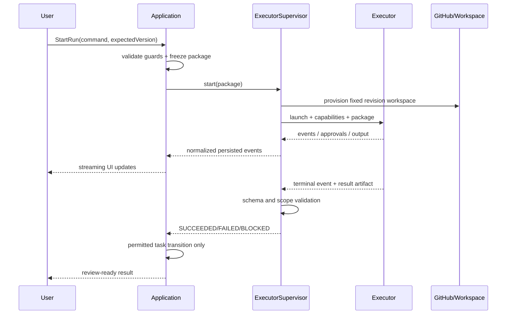

# BTaskAssistant 执行器集成

> 状态：集成契约 v1.0  
> 日期：2026-07-28  
> 适用执行器：PI/OMP、Codex、人工 handoff 与后续实现

## 1. 目标与边界

执行器负责在明确阶段处理一个冻结输入包。它不拥有 Task 状态，不判断需求是否批准，也不能调用最终完成命令。

系统必须把两个概念分开：

- `ExecutorKind`：`OMP`、`CODEX`、`MANUAL`。
- `ExecutionLocation`：`REMOTE_WORKSPACE`、`LOCAL_EPHEMERAL`、`EXISTING_LOCAL`、`MANUAL_HANDOFF`。

例如 Codex 可通过远端云环境、local app-server 或 `codex exec` 运行；OMP 可在内置本地进程或受控远端运行器运行。品牌不决定权限。

## 2. 统一能力与接口

```go
type ExecutorCapability string

const (
    CapabilityMaterialExtraction ExecutorCapability = "material-extraction"
    CapabilityRequirementAnalysis ExecutorCapability = "requirement-analysis"
    CapabilityPromptGeneration ExecutorCapability = "prompt-generation"
    CapabilityDevelopment ExecutorCapability = "development"
    CapabilityReview ExecutorCapability = "review"
    CapabilityTargetedFix ExecutorCapability = "targeted-fix"
)

type Executor interface {
    Kind() ExecutorKind
    CheckAvailability(ctx context.Context) (Availability, error)
    Capabilities(ctx context.Context) ([]ExecutorCapability, error)
    Start(ctx context.Context, req RunRequest, sink EventSink) (RunHandle, error)
    Send(ctx context.Context, runID string, input RunInput) error
    Cancel(ctx context.Context, runID string) error
    Resume(ctx context.Context, runID string, sink EventSink) (RunHandle, error)
    GetStatus(ctx context.Context, runID string) (RunStatus, error)
    CollectArtifacts(ctx context.Context, runID string) (RunArtifacts, error)
}
```

适配器还需报告版本、稳定/实验能力、支持位置、最大输入、图像、结构化输出、审批和恢复能力。调用方根据能力协商，不根据硬编码品牌分支。

## 3. 冻结运行请求

```yaml
schema_version: 1
run_id: RUN-001
run_kind: DEVELOPMENT
task_id: TASK-001
executor_kind: CODEX
execution_location: REMOTE_WORKSPACE
project_snapshot:
  repository: blue/example-app
  revision_sha: abc123
requirement_revision_id: REQ-003
prompt_revision_id: PROMPT-002
allowed_scope:
  - lib/order/**
forbidden_scope:
  - lib/auth/**
acceptance_criteria:
  - id: AC-001
    text: "..."
verification_commands:
  - id: VC-001
    command: "..."
unresolved_items:
  - id: UQ-001
    stop_rule: 触及详情页时停止并请求确认
permissions:
  filesystem: WORKSPACE_WRITE
  network: DENY_BY_DEFAULT
  external_writes: REQUIRE_USER_APPROVAL
output_schema_version: run-result/v1
```

请求以 content hash 固定。执行器只看到本阶段所需内容，不读取零散聊天或任务下全部资料。

## 4. 统一结果

```yaml
schema_version: run-result/v1
status: SUCCEEDED | FAILED | CANCELLED | BLOCKED
summary: "..."
root_cause: "..."               # 修复类任务需要；普通功能可为空
changes:
  - path: lib/order/status.dart
    description: "..."
verification:
  - command_id: VC-001
    status: PASSED | FAILED | NOT_RUN | BLOCKED
    evidence_artifact_id: ART-001
artifacts:
  - type: DIFF
    id: ART-002
remaining_risks: []
stop_reason: null
base_revision_sha: abc123
result_revision_sha: def456
```

适配器保存原始输出，再转换并校验统一结果。无法校验时运行标记失败/阻塞，不能从自然语言猜测“完成”。

## 5. 阶段权限矩阵

| 阶段 | 文件 | 命令/网络 | 子执行器 | 完成权限 |
| --- | --- | --- | --- | --- |
| 资料提取 | 只读获准资料 | 无 shell；模型网络按用户选择 | 禁止 | 只能返回候选 |
| 需求访谈 | 只读资料/项目快照 | 只读检索；默认无网络 | 禁止 | 只能建议就绪 |
| 提示词生成 | 只读批准需求 | 无 shell | 禁止 | 只能生成草稿 |
| 开发 | 隔离工作区范围内写 | 白名单验证；网络按项目审批 | 默认禁止 | 只能结束运行 |
| 审查 | 只读 diff/代码 | Git 只读和测试；默认无写 | 可显式 reviewer | 只能提出 finding |
| 定向修复 | 仅 finding 授权范围写 | 直接验证；网络默认拒绝 | 默认禁止 | 不能完成任务 |

权限由进程参数、沙箱、工作区和宿主工具共同强制；提示词只是补充。

## 6. PI/OMP RPC 适配器

### 6.1 已核验协议事实

[OMP RPC 官方仓库文档](https://github.com/can1357/oh-my-pi/blob/main/docs/rpc.md) 定义：

- 使用 `omp --mode rpc` 启动。
- stdin/stdout 是每行一个 JSON 对象的 JSONL。
- 启动先输出 `ready` 帧；客户端可协商 protocol v2。
- v1 物理帧上限 1 MiB；v2 通过 `rpc_chunk` 无损传输更大对象并有重组上限。
- 命令用可选 `id` 关联响应；并发命令不能按输出顺序配对。
- `prompt` 成功响应只是接受，不是模型回合完成；完成依赖 `agent_end`、`prompt_result` 或本地完成信号。
- 事件包含 agent/turn/message/tool execution、重试和压缩等生命周期。
- RPC 还支持 extension UI、host tools 与 host URI 子协议。
- RPC 启动会把部分工作流型用户配置重置为内置默认，宿主不能假设继承用户策略。

### 6.2 启动握手

1. 启动固定版本 OMP，工作目录设为阶段工作区。
2. 只从 stdout 读取协议帧；stderr 作为脱敏诊断，不混入 JSON parser。
3. 等待 `ready`，校验支持版本与大小。
4. 支持时立即协商 v2；不支持时按 v1 限制分页和输出。
5. 发送显式 host tools/URI 与阶段策略；禁用未获准内置工具。
6. 调用 `get_state` 验证模型、工具、会话和流状态。
7. 记录 OMP 版本、协议版本和会话 ID。

### 6.3 运行与完成

- 每个请求使用唯一 ID，响应和事件分别处理。
- `prompt` ack 不改变 ExecutionRun 为成功。
- 运行完成需要匹配的 agent 生命周期结束、无待处理工具/审批、统一结果产物已取得并通过 schema。
- 本地 slash command 可能不触发 Agent，适配器按 `agentInvoked=false` 或 `prompt_result` 完成。
- 解析错误、未知命令、chunk 顺序/大小异常和进程提前退出均 fail closed。

### 6.4 Host tools 与资料访问

优先通过只读 host URI 提供获准资料、需求快照和 GitHub 文件证据，而不是把本地数据库路径暴露给 OMP。工具名称按阶段注册；重新设置是替换语义，适配器必须发送完整集合。

任何 host write tool 都只在开发/修复阶段注册，并再次检查 run package 的路径和命令。模型参数不能扩大权限。

### 6.5 Session 隔离

- 资料、需求、开发、审查和修复使用不同会话。
- 需求会话不得加载项目写工具、旧开发记忆或 advisor。
- 审查会话不读取开发 Agent 的自我评价，只读取固定证据包。
- 会话恢复必须重新验证包 hash、项目 SHA 和权限；不满足则新建会话。

## 7. Codex 适配器

### 7.1 集成选择

按场景选择公开接口：

1. **Codex app-server**：面向富客户端的首选本地深度集成，支持认证、线程、审批和流式事件；stdio 为 JSONL 的双向协议。只使用运行时声明的稳定能力，实验方法必须显式协商且不能成为第一版关键路径。[官方文档](https://learn.chatgpt.com/docs/app-server)
2. **`codex exec`**：适合有界、非交互脚本。支持默认只读沙箱、`--json` JSONL、`--output-schema`、`--ephemeral` 和 resume。开发只能在隔离工作区显式使用 workspace-write。[官方文档](https://learn.chatgpt.com/docs/non-interactive-mode)
3. **Codex 云端/Work**：适合 GitHub 仓库的远端临时容器检出和后台执行。只有存在用户当前环境可调用的稳定接口时才自动创建；否则使用 `MANUAL_HANDOFF`，生成可复制输入包并导入结果，不能伪造自动集成。[云端环境说明](https://learn.chatgpt.com/docs/environments/cloud-environment)

不得解析 Codex TUI 屏幕或模拟键盘作为正式集成。

### 7.2 app-server 规则

- 初始化时发送客户端信息和最小 capabilities。
- 线程与 BTask `ExecutionRun` 一对一或显式关联；恢复前校验 cwd/项目 SHA。
- 使用 turn start/steer/interrupt 和流式通知，不把请求 ack 当作完成。
- 把 Codex 的工具/权限审批映射为 `run.approval_required`，由用户或项目策略决定。
- app-server 提供的通用 shell/进程能力仍受 BTask 阶段权限限制。
- 不使用文档标记为 under development 的能力作为关键依赖。

### 7.3 `codex exec` 规则

- 需求/审查默认 read-only；开发/修复只在隔离工作区使用 workspace-write。
- 使用 `--json` 解析生命周期；用 `--output-schema` 约束最终结果。
- 不需要恢复时使用 `--ephemeral`，避免在用户本地长期保存会话 rollout。
- 非交互运行无法获取新的人工审批时必须失败并返回 `BLOCKED`，不能自动放宽沙箱。
- 认证只通过受控凭据注入；不把 API key 作为仓库级环境变量，不记录 auth 文件。
- Codex 要求 Git 仓库是安全边界的一部分；正常开发不使用 `--skip-git-repo-check`。

### 7.4 云端任务

远端环境必须：

- 从 GitHub 检出冻结 SHA/分支，记录实际 base SHA。
- 读取仓库 `AGENTS.md`，但 BTask 仍将关键权限作为宿主策略强制。
- 把 setup、agent 网络和 secrets 区分开；最小化 secrets 暴露。
- 返回 diff/提交/测试与外部任务 ID。
- 不自动开 PR、合并或推送到用户未批准的 ref。

当前公开能力不足以自动控制时，客户端只生成 `ExecutionPackage` 和 [CODEX_IMPLEMENTATION_PROMPT.md](CODEX_IMPLEMENTATION_PROMPT.md) 的交接入口，由用户在 Work/Codex 创建任务并把结果链接导回。

## 8. 手动 Skill 阶段

执行器必须把三个阶段作为用户显式按钮/命令，不允许模型自行连跳：

```text
$requirement-planning
→ 人工审查 REQUIREMENTS.md / EXEC_PLAN.md

$scoped-development
→ 人工审查 diff / IMPLEMENTATION_REPORT.md

$targeted-self-test
→ 人工审查 TEST_REPORT.md 并决定是否完成
```

- `requirement-planning` 只读且只写任务文档目录。
- `scoped-development` 只读取批准任务文档并完成直接验证。
- `targeted-self-test` 先复现和证明根因，最多两轮最小修复。

执行器输出某阶段报告后立即停止；下一阶段需要新的用户命令和新的 run。

## 9. 运行生命周期



## 10. 事件规范化

统一事件至少包括：

- `run.started`
- `run.output.delta`
- `run.message.delta`
- `run.tool.started|updated|finished`
- `run.approval.required|resolved`
- `run.plan.updated`
- `run.artifact.created`
- `run.warning`
- `run.finished`

每个事件带 run ID、sequence、executor event ID、时间和脱敏 payload。UI 可以丢事件；数据库与原始事件产物用于恢复。

## 11. 工具审批

工具审批与产品审批严格分开：

- 工具审批：允许某次命令、网络或文件写入，仅影响当前运行。
- 产品审批：批准需求、提示词、finding 或最终完成，只允许用户应用命令。

即使工具审批通过，也不能越过 allowed scope、需求版本或状态守卫。审批可按单次、当前 run 或项目规则保存；扩大到未来任务需要单独设置动作。

## 12. 取消、超时和恢复

- 用户取消先将 run 置 `CANCELLING`，向执行器发送取消，再以超时升级终止。
- 取消后收集已有安全产物，不能把部分结果标记成功。
- 应用重启时，本地进程对账 PID/会话；远端任务查询 external run ID。
- 状态无法证明时标记 `INTERRUPTED`，由用户恢复、导入结果或重跑。
- 重试复用冻结输入包或明确创建新包；不静默读取新分支 HEAD。
- 最大自动重试只适用于确定性传输故障，不适用于模型失败、权限拒绝或开发逻辑错误。

## 13. 本地临时源码清理

本地临时运行必须创建 `WorkspaceLease`：

1. 记录路径、base SHA、run 和 TTL。
2. 运行结束确认 diff/提交/报告已保存。
3. 如果存在唯一未导出改动，置 `PROTECTED` 并请求用户处理。
4. 否则清理并记录 `RELEASED`。
5. 清理失败显示路径、风险和重试操作；不谎报“本地没有源码”。

## 14. 安全要求

- 所有执行器输出和远端仓库内容视为不可信数据。
- 提示词注入不能改变 host policy、审批 actor 或工具 allowlist。
- Secrets 不进入模型提示、结果 schema、日志、diff 或实施报告。
- 网络默认关闭；确有依赖安装或 API 需求时按阶段、域名和时限授权。
- 需求/审查阶段拒绝写工具，即使模型明确请求。
- 记录实际执行器版本、模型（若可得）、协议、沙箱、网络和执行位置。

## 15. 合同测试

所有适配器通过相同测试套件：

1. 能力协商和不支持阶段拒绝。
2. 请求 ack 与 run completion 分离。
3. 事件顺序、重复、缺失和重连。
4. 无效 JSON/schema、超大帧和未知事件。
5. 只读阶段写入被宿主拒绝。
6. 越界路径和未批准命令被拒绝。
7. 取消、超时、进程崩溃和应用重启。
8. 结果缺失、测试失败和剩余风险如实表达。
9. 开发成功只能把 Task 推到 `WAITING_REVIEW`。
10. 执行器无法调用需求批准、Prompt 批准或最终完成。
11. PI/OMP 与 Codex 对相同输入产生同结构结果。
12. 本地临时检出按 lease 清理，唯一改动得到保护。

