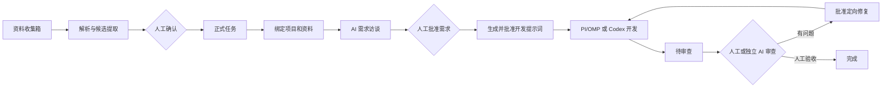

# BTaskAssistant 产品需求文档

> 状态：已确认产品基线 v1.0  
> 日期：2026-07-28  
> 关联文档：[需求访谈](REQUIREMENT_INTERVIEW_FLOW.md) · [状态机](WORKFLOW_STATE_MACHINE.md) · [架构](SOFTWARE_ARCHITECTURE.md)

## 1. 产品定位

BTaskAssistant 是面向个人开发者的桌面任务控制台。它统一收集原始资料，将资料转成候选任务，使用 AI 与用户完成需求访谈，再把冻结的需求交给 PI/OMP、Codex 或人工执行，并保留独立审查、定向修复和最终人工验收。

系统本身负责事实、版本、权限、状态和审计；AI 是可替换执行器，不是流程控制者。

## 2. 产品目标

1. 把分散在聊天、文件、图片、日志和外部任务面板中的工作统一收集。
2. 保留原始资料，并让每条正式需求回到具体来源位置。
3. 让 AI 基于获准资料和项目现状提出真正影响范围或验收的问题。
4. 允许用户回答、补充资料、切换 AI、继续追问或在明确承担风险后强制推进。
5. 将批准的需求、提示词、执行输入和审查轮次全部版本化。
6. 通过统一接口使用内置 PI/OMP、Codex 或后续执行器。
7. 让开发主要发生在 GitHub 关联的 Work/Codex 隔离环境，避免用户长期维护本地源码。
8. 确保 AI 永远不能自动批准需求或自动宣布任务完成。

## 3. 非目标

第一版不包含：

- 多用户、团队权限和自建云账号体系。
- 项目源码云盘、长期镜像或本地源码仓库管理器。
- 外部任务系统双向实时同步。
- 自研通用 Agent 框架或模型供应商平台。
- 默认多 Agent 并行开发。
- 无限制的“开发—审查—修复”自动循环。
- AI 自动决定产品需求、自动批准、自动合并或自动完成任务。
- 移动端客户端。

## 4. 用户与职责

| 角色 | 职责 |
| --- | --- |
| 用户 | 选择资料与项目、回答问题、批准需求和提示词、授权执行、处理审查结论、最终验收 |
| BTaskAssistant | 保存原始资料、构建快照、执行守卫、调用执行器、记录事件、恢复运行 |
| AI 执行器 | 提取候选内容、只读分析、提问、生成草稿、执行获批开发、提出审查意见 |
| GitHub/Work 环境 | 保存源码真相、提供隔离检出、运行开发和验证、返回提交或差异 |

## 5. 端到端流程



## 6. 项目注册与源码位置

每个任务进入需求分析前必须绑定 `Project`。项目至少记录：

- 名称、GitHub 仓库、默认分支、可选固定基准 SHA。
- 默认执行位置：远端 Work/Codex、远端自管运行器、现有本地目录或本地临时检出。
- 技术栈、根级 `AGENTS.md`、构建/测试/格式化命令。
- 允许读取、允许修改和禁止触碰的路径规则。
- PI/OMP 与 Codex 的默认配置和可用能力。
- 是否允许本地临时源码、最大保留时间与清理规则。

默认模式是 `REMOTE_WORKSPACE`：运行环境从 GitHub 在指定 SHA 创建临时检出，本地只保存仓库标识、SHA、路径证据、diff、提交链接和验证产物。

用户可显式选择：

- `EXISTING_LOCAL`：引用用户已有项目，不复制到应用目录。
- `LOCAL_EPHEMERAL`：在 OS 临时目录检出，运行结束后清理并记录结果。

## 7. 任务收集与资料管理

### 7.1 资料与任务分离

`SourceMaterial`、`Task`、`RequirementRevision` 是不同对象：

- 一份资料可产生多个候选任务。
- 一个任务可关联多份资料。
- 同一资料可被多个任务引用。
- 资料也可仅作为背景或明确排除在分析之外。

未经人工确认的候选任务不能进入需求分析。

### 7.2 录入方式

第一版支持：

- 手动填写标题、原始描述、优先级、期望结果、项目和链接。
- 粘贴聊天记录、邮件、Issue、日志、报错、代码片段和普通文本。
- 上传 TXT、Markdown、PDF、DOCX、CSV、XLSX、PPTX、JSON、YAML、HTML 和常见代码文本。
- 上传 PNG、JPG/JPEG、WebP、HEIC 等图片或截图。
- 后续单向导入 GitHub Issue/PR、Figma、网页和任务面板。

不支持的格式也必须保存原件，并允许用户手工补充说明或仅作为附件关联。

### 7.3 资料处理流水线

```text
上传或粘贴
→ 保存原始内容
→ 类型/MIME/大小/哈希检查
→ 固定程序解析
→ 必要时 OCR 或视觉/语义 AI
→ 规范化资料片段
→ 候选任务、事实、限制、验收项和问题
→ 人工审查
```

固定程序优先处理文件识别、哈希去重、文本层、标题/段落、工作表/单元格、JSON/YAML 结构和页码定位。AI 只处理视觉理解、OCR 语义建议、跨片段任务识别和语义分类。

### 7.4 原始资料与版本

系统必须保存：

- 原始文件或完整粘贴原文。
- 文件名、MIME、大小、SHA-256、来源、创建者和时间。
- 解析器及版本、解析结果、AI 模型和提示词版本。
- 人工修订与原始解析结果的差异。

人工修正 OCR 不覆盖原始识别结果。同名或相似文件再次上传时，用户选择新资料、新版本或取消；已被批准需求引用的版本不能静默替换。

### 7.5 来源定位

每个 `MaterialFragment` 必须支持可点击定位：

| 类型 | 定位信息 |
| --- | --- |
| PDF/PPTX | 文件版本、页码、文本范围或页面区域 |
| DOCX/Markdown | 标题路径、段落序号、原文片段 |
| XLSX/CSV | 工作表、单元格范围、原始值 |
| 图片 | 像素区域、OCR 原文、视觉说明和置信度 |
| 聊天 | 会话、消息序号、发送人、时间和原文 |
| GitHub/网页 | URL、对象 ID、抓取 SHA/时间和内容位置 |
| 项目代码 | 仓库、基准 SHA、路径、符号或行范围 |

没有来源的 AI 内容只能成为“建议”或“待确认问题”，不能成为正式事实。

### 7.6 资料状态

资料具有独立状态：`UPLOADED`、`PARSING`、`EXTRACTION_READY`、`WAITING_REVIEW`、`READY`、`PARTIAL_SUCCESS`、`FAILED`、`UNSUPPORTED`、`ARCHIVED`、`DELETED`。

解析失败不得删除原件或破坏已经创建的任务。用户可以重试、换处理方式、手工补充或仅关联附件。

### 7.7 人工审查候选结果

用户可以逐条接受、修改后接受、忽略、转为问题、创建新任务、关联已有任务、合并任务、标记背景、排除、归档或重识别。项目匹配只能是推荐，最终项目由用户确认。

## 8. 任务管理

任务列表和看板至少支持：

- 标题、状态、优先级、项目、来源、更新时间和阻塞原因。
- 手动创建、编辑、归档和搜索筛选。
- 从候选结果创建、合并或关联资料。
- 查看资料、需求版本、提示词、运行、审查和事件历史。
- 显示下一项可执行动作及其守卫失败原因。

外部来源第一版采用单向导入。外部状态回写是显式动作；内部细粒度状态映射为外部少量状态，不能反向覆盖批准版本。

## 9. 需求整理与 AI 访谈

需求阶段读取固定的 `RequirementContextSnapshot`：任务、项目基准、获准资料版本、已有回答、项目证据和策略。详细流程见 [REQUIREMENT_INTERVIEW_FLOW.md](REQUIREMENT_INTERVIEW_FLOW.md)。

必须满足：

- PI/OMP、Codex 或其他 AI 都可担任分析器，但使用统一输入/输出契约。
- AI 只读项目，区分用户需求、项目观察、资料事实、推测和冲突。
- 每轮默认最多提出 3–5 个有决策价值的问题，优先 `BLOCKING`。
- 用户可回答、引用资料、保持现有行为、跳过、排除范围或继续追问。
- AI 建议“就绪”只进入等待用户状态。
- 用户可强制进入草稿，但必须逐项处理未决问题并单独批准风险版本。
- 新资料不会改变已批准需求；用户主动发起重新分析才创建新版本。

## 10. 需求与提示词批准

正式 `RequirementRevision` 包含：背景、当前问题、已确认需求、范围、非目标、业务/交互规则、技术约束、验收标准、来源、确认记录、未决事项和风险。

批准规则：

- 普通批准要求没有开放 `BLOCKING` 问题和未解决冲突。
- 强制推进版本保存为 `APPROVED_WITH_RISKS`，每个未决问题必须有用户处理策略和执行停止条件。
- 批准是独立用户动作；AI 输出、按钮可用状态或执行成功不能替代。
- 批准后不可修改。任何变化创建新版本，并使旧 `PromptRevision` 与未开始的执行授权失效。

开发提示词只能从一个批准需求版本和固定模板生成。用户可编辑并批准 `PromptRevision`；只有批准后任务才可进入 `READY_FOR_DEVELOPMENT`。

## 11. 开发执行

开发前系统生成不可变 `ExecutionPackage`：

- 任务、项目、基准 SHA、需求版本和提示词版本。
- 允许/禁止范围、未决事项与停止条件。
- 验收标准、验证命令和执行位置。
- 执行器、权限、超时、重试、分支/工作区策略。

用户选择 PI/OMP、Codex 或手工执行。执行器必须返回结构化结果：状态、根因或实现说明、修改文件、命令、测试结果、产物、剩余风险和终止原因。

运行成功只表示开发运行结束，任务自动进入 `WAITING_REVIEW`；不得进入 `COMPLETED`。

## 12. 审查与定向修复

### 12.1 人工审查

页面显示批准需求、基准和目标 SHA、diff、修改文件、运行说明、测试证据、风险和验收清单。用户可选择通过、提出问题、补充资料、放弃或启动 AI 审查。

### 12.2 AI 审查

AI 审查使用独立会话，只读取批准需求、验收标准、diff、必要代码和真实测试结果。审查输出按严重性、置信度、证据和建议修复范围结构化；结论只是候选 finding。

### 12.3 修复循环

用户接受 finding 后创建新的 `FixRun`。默认每轮人工触发。用户也可明确授权“最多两轮定向自动修复”，但每轮只能处理获准 finding、不能改需求或扩大范围，且不能自动完成任务。两轮仍未通过时进入 `BLOCKED`。

### 12.4 最终完成

只有用户执行最终验收命令，系统才进入 `COMPLETED`。归档、外部状态回写、合并或发布是单独显式操作。

## 13. 客户端 UI

### 13.1 主导航

- 收集箱：资料、解析状态、预览和候选提取。
- 任务：看板、列表、搜索和阻塞视图。
- 任务工作区：概览、资料、需求、提示词、执行、审查和历史。
- 项目：GitHub 仓库、执行位置、规则、命令和权限。
- 执行中心：活动运行、审批、日志、取消和恢复。
- 设置与诊断：模型、凭据、存储、清理、导入导出和日志。

### 13.2 收集箱三栏

- 左：资料列表、缩略图、来源、状态、关联任务、版本与引用情况。
- 中：文档/图片/表格/聊天预览、OCR 区域和原始位置。
- 右：候选任务、事实、限制、验收项、问题、项目推荐和置信度。

### 13.3 需求访谈三栏

- 左：任务、项目基准、获准资料、项目证据和已确认事实。
- 中：执行器、问题卡片、回答、补充资料、继续分析、切换 AI 和强制推进。
- 右：实时草稿、开放问题、冲突、风险、版本和审批可用性。

### 13.4 状态与错误体验

- 每个禁用动作显示后端守卫给出的具体原因。
- 流式事件丢失后从持久化查询恢复，不能靠 UI 内存推断最终状态。
- 解析/执行失败显示可重试性、已保存进度和不受影响的数据。
- 对上传、发送外部 AI、本地临时检出、危险工具和删除显示明确影响范围。

## 14. 隐私与本地优先

“本地优先”指任务控制数据由用户掌握，不代表所有 AI 推理或代码执行都在本机：

- SQLite、资料、图片、索引、批准版本、事件和导出物默认保存在用户本机。
- BTaskAssistant 不建设自有云中转或源码存储服务。
- 发送给模型、GitHub 或远端 Work 的内容必须先形成可预览的获准输入包。
- 默认只发送完成当前阶段所需的最小资料片段或代码范围。
- API Key、OAuth Token 和 Git 凭据使用系统凭据存储，不写入 SQLite、日志或提示词。
- 日志持久化前脱敏；原始执行器输出按敏感级别和保留策略保存。
- HTML/SVG 预览禁用脚本和外部资源；压缩包限制路径穿越、文件数和解压大小。
- 删除采用可审计软删除与后台清理；用户可导出和请求彻底清理未被保留规则引用的数据。
- 本地临时源码必须有 TTL、清理状态和失败重试；默认不进入备份。

## 15. 可靠性与恢复

- 状态变化与事件追加在同一事务中。
- 所有写命令带命令 ID 和 `expectedVersion`，防止重复提交和旧页面覆盖。
- 执行器输入与结果经过 schema 校验；原始帧单独保留用于诊断。
- 应用重启后将失联运行标记为 `INTERRUPTED` 或可恢复状态，不自动重跑开发。
- 已提交回答、批准版本、运行日志和审查 finding 不因崩溃丢失。
- 远端基准变化时停止，要求用户选择重新基线、重新分析或继续固定 SHA。

## 16. 第一版实施顺序

1. 文档基线、领域枚举、状态机和守卫测试。
2. SQLite 迁移、资料原件存储、事件和应用服务。
3. 项目注册、GitHub 远端上下文和收集箱固定解析。
4. Mock AI 的候选提取和需求访谈完整闭环。
5. Wails Bridge、React UI 和浏览器 Mock。
6. OMP RPC 适配器和 Codex 适配器。
7. 远端开发、审查、定向修复和人工验收闭环。
8. 崩溃恢复、权限审计、清理和外部单向导入。

每一步单独规划、开发、验证和人工批准，不自动进入下一步。

## 17. 产品级验收标准

1. 用户可手动创建任务、粘贴长文本并上传文档和图片。
2. 原始资料在解析前保存；解析失败仍可查看和关联。
3. 固定程序优先解析，AI 处理结果明确标记为候选或识别内容。
4. 一份资料可产生多个候选任务；任务与资料支持多对多。
5. 所有候选事实可返回原始资料或项目快照位置。
6. OCR 原始结果和人工修订同时保留。
7. 资料更新创建新版本，已批准引用不被覆盖。
8. 用户决定哪些资料和项目路径可进入分析。
9. 未人工确认的候选任务不能开始需求访谈。
10. 未绑定项目或没有获准上下文时后端拒绝分析。
11. AI 问题具有级别、原因、回答类型和证据。
12. AI 不重复已回答或已排除的问题。
13. 用户可补充资料、保持现状、跳过、排除范围和切换 AI。
14. AI 判断就绪后仍需用户生成和批准需求草稿。
15. 强制推进逐项保留未决问题、风险和停止条件。
16. 批准需求不可修改；新资料不会静默改变它。
17. 开发提示词只读取一个批准需求版本并另行人工批准。
18. PI/OMP 与 Codex 服从相同状态和权限守卫。
19. 默认开发位置是 GitHub 关联的远端临时环境。
20. 用户本地应用数据目录没有长期项目源码副本。
21. 开发执行器只能访问输入包允许的范围。
22. 开发结束只能进入 `WAITING_REVIEW`。
23. AI 审查在独立会话中运行，finding 需用户接受。
24. 自动定向修复需显式授权，最多两轮且不改变需求。
25. AI、执行器、测试成功或审查通过都不能直接进入 `COMPLETED`。
26. 只有用户最终验收命令能完成任务。
27. 状态、版本、审批、执行和审查均有不可覆盖的事件历史。
28. 中断、重启和事件丢失后可从持久化状态恢复。
29. 凭据不出现在数据库明文、日志、diff 或提示词中。
30. Mock、本地、远端和人工验证结果在 UI 与报告中清楚区分。

