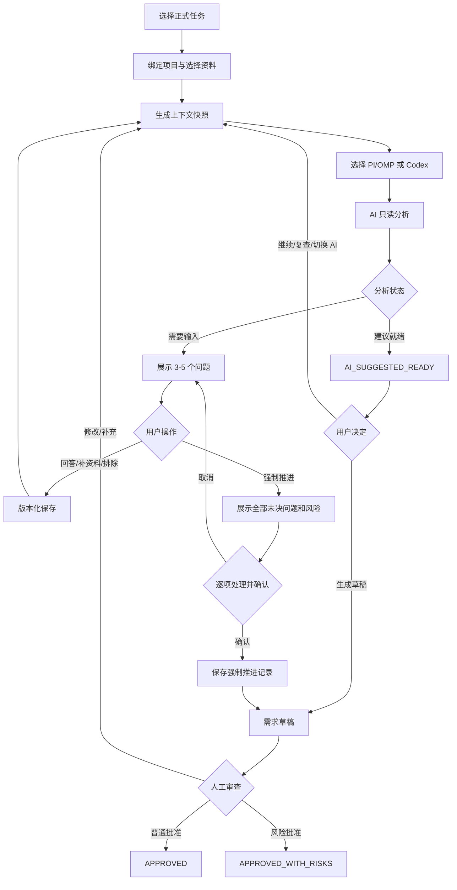

# BTaskAssistant 需求整理与 AI 访谈流程

> 状态：已确认流程 v1.0  
> 日期：2026-07-28  
> 权威状态定义见 [WORKFLOW_STATE_MACHINE.md](WORKFLOW_STATE_MACHINE.md)。

## 1. 阶段定位

需求整理不是让 AI 直接写最终需求，而是让 AI 基于当前任务、获准资料和固定项目证据发现信息缺口，通过多轮问题帮助用户明确目标、范围、约束和验收标准。

职责固定为：

- AI：读取授权快照、区分事实与推测、发现冲突、提出问题、生成候选草稿。
- 用户：回答、补充资料、排除范围、决定是否继续、承担强制推进风险、批准正式版本。
- 系统：构建快照、强制权限、去重、版本化、执行状态守卫和审计。

AI 可以建议“当前没有明显疑问”，但不能批准需求、启动开发或完成任务。

## 2. 前置条件

创建 `RequirementSession` 前必须：

1. 候选任务已经人工确认并处于 `TASK_READY`。
2. 任务已绑定一个明确 `Project`。
3. 用户选择至少一份 `READY` 资料或明确的任务原始描述作为分析输入。
4. 用户确认允许读取的项目仓库、基准 SHA 和路径范围。
5. 选择具备 `requirement-analysis` 能力的执行器。
6. 同一会话没有另一个写入中的分析运行。

默认从 GitHub 按固定 SHA 获取项目上下文。系统不把整仓源码持久化到本地；只保存获准文件片段、哈希、路径和来源。用户选择本地项目时也必须固定 Git 基准或记录无 Git 快照限制。

## 3. 固定分析输入快照

每轮分析使用不可变 `RequirementContextSnapshot`，不能把整段历史聊天随意拼接给 AI。

```yaml
schema_version: 1
session_id: RS-001
round: 2
task:
  id: TASK-001
  title: 购买记录页面样式对齐
  original_description: "..."
project:
  id: PROJECT-001
  repository: blue/example-app
  baseline_revision: abc123
  execution_location: REMOTE_WORKSPACE
  allowed_read_paths:
    - lib/order/**
  evidence:
    - id: PE-001
      path: lib/order/widgets/order_status.dart
      content_hash: sha256:...
materials:
  - material_id: MATERIAL-001
    version_id: MV-002
    relationship: PRIMARY_SOURCE
    fragments:
      - id: FRAGMENT-001
        content: "..."
        source_location: message-12
previous_answers:
  - question_id: QUESTION-001
    answer_revision_id: ANSWER-002
existing_draft_revision_id: REQ-DRAFT-002
policy:
  allow_project_read: true
  allow_code_write: false
  allow_assumption: false
  require_source_for_fact: true
  max_questions_per_round: 5
```

快照记录全部引用版本与内容哈希。新增资料、回答修订或项目 SHA 变化不会修改旧快照；用户明确执行“使用新资料重新分析”才创建新快照和轮次。

## 4. 角色权限

| 动作 | 用户 | 系统 | AI |
| --- | --- | --- | --- |
| 选择任务/项目/资料 | 决定 | 校验保存 | 只能推荐 |
| 读取项目与资料 | 授权 | 生成最小只读快照 | 仅在授权范围内读取 |
| 提出问题 | 可补充关注点 | 保存、去重、排序 | 生成候选问题 |
| 回答问题 | 唯一决定者 | 版本化保存 | 不得代答 |
| 建议结束访谈 | 可随时决定 | 保存建议 | 可返回就绪判断 |
| 强制推进 | 发起、逐项决定并确认 | 生成风险快照、执行守卫 | 不得阻止或代确认 |
| 生成草稿 | 发起 | 固定输入并保存 revision | 生成候选内容 |
| 批准需求 | 唯一决定者 | 校验、冻结、写事件 | 无权限 |

## 5. 完整流程



## 6. AI 分析职责

AI 必须分别输出：

- `confirmed_facts`：有资料或用户回答来源的候选事实。
- `project_observations`：固定 SHA 下的当前实现，不自动成为需求。
- `constraints`、`acceptance_candidates`、`non_goal_candidates`：仍需人工确认的候选内容。
- `questions`：真正影响行为、范围、验收、异常策略或技术边界的问题。
- `conflicts`：资料、用户回答或项目证据之间的冲突。
- `analysis_status` 与建议动作。

AI 不得：

- 根据行业习惯补全产品需求。
- 将“项目当前行为”直接改写为“本次必须保持”。
- 在本阶段修改源码、配置、依赖、Git 或数据库。
- 因追求完整而无限询问可选优化。
- 重复已回答、已排除或语义等价的问题。

## 7. 结构化输出

```yaml
schema_version: 1
analysis_id: ANALYSIS-005
round: 3
analysis_status: NEEDS_USER_INPUT
confirmed_facts:
  - client_key: status-style
    content: 三种订单状态样式需要与设计稿一致
    source_refs:
      - type: MATERIAL_FRAGMENT
        id: FRAGMENT-001
project_observations:
  - client_key: shared-widget
    content: 列表和详情共用 OrderStatus 组件
    evidence:
      repository: blue/example-app
      revision: abc123
      path: lib/order/widgets/order_status.dart
questions:
  - client_key: scope-shared-widget
    category: SCOPE
    severity: BLOCKING
    question: 修改范围是否包含订单详情页？
    reason: 共享组件会让答案改变允许修改范围和回归场景。
    answer_type: SINGLE_SELECT
    options:
      - 只修改列表页
      - 列表和详情页都修改
    source_refs:
      - type: PROJECT_OBSERVATION
        client_key: shared-widget
conflicts: []
recommended_action: ASK_QUESTIONS
```

允许的 `analysis_status`：

- `NEEDS_USER_INPUT`
- `NO_BLOCKING_QUESTIONS`
- `READY_FOR_DRAFT`
- `INSUFFICIENT_MATERIALS`
- `PROJECT_UNAVAILABLE`
- `ANALYSIS_FAILED`

宿主进行 JSON Schema、引用存在性、权限范围和大小校验。无效结果作为运行产物保存，但不得推进会话状态。

## 8. 问题规则

### 8.1 级别

| 级别 | 定义 | 默认影响 |
| --- | --- | --- |
| `BLOCKING` | 不回答无法确定核心行为、范围或可验收结果 | 阻止普通批准 |
| `IMPORTANT` | 可继续但会影响体验、错误处理或实现选择 | 可跳过，风险入草稿 |
| `OPTIONAL` | 优化或非核心细节 | 不阻止草稿 |

### 8.2 问题必须满足

1. 说明“不回答会影响什么”。
2. 引用触发它的资料、回答、冲突或项目证据。
3. 不能通过继续只读检查项目直接解决。
4. 不包含推荐默认后再由 AI 静默采用的答案。
5. 新问题由新回答、新资料、新项目证据或冲突触发。
6. 每轮默认最多五个，优先阻塞问题。

### 8.3 回答类型

- `TEXT`
- `SINGLE_SELECT`
- `MULTI_SELECT`
- `BOOLEAN`
- `FILE_OR_IMAGE`
- `MATERIAL_REFERENCE`
- `PROJECT_REFERENCE`
- `CONFIRM_EXISTING_BEHAVIOR`

## 9. 用户回答

用户可：

- 直接输入或选择答案。
- 上传文档/图片或引用已有资料片段。
- 引用固定项目文件证据。
- 选择“保持当前行为”；系统同时保存基准 SHA、证据和快照。
- `SKIPPED`：暂时跳过，仍保持开放。
- `OUT_OF_SCOPE`：明确排除，写入非目标，AI 不再扩展。

回答采用追加版本。修改答案创建 `RequirementAnswerRevision`，旧版本保留但不再活跃。

## 10. AI 建议就绪

AI 返回 `NO_BLOCKING_QUESTIONS` 或 `READY_FOR_DRAFT` 时，还需返回：

- 已确认事实、限制、非目标和验收候选数量。
- 剩余 `BLOCKING`、`IMPORTANT`、`OPTIONAL` 数量。
- 未解决冲突。
- 建议结束访谈的理由。

系统只进入 `AI_SUGGESTED_READY`。用户仍可继续说明、指定复查角度、换 AI 或生成草稿。

## 11. 强制推进

“强制进入下一步”只结束访谈并生成可审查草稿，不是批准，也不允许 AI 猜答案。

系统冻结未决问题快照，并要求用户逐项选择：

| 策略 | 含义 | 开发约束 |
| --- | --- | --- |
| `KEEP_UNRESOLVED` | 保持未确认 | 触及相关内容时停止并请求确认 |
| `FOLLOW_EXISTING_BEHAVIOR` | 沿用固定基准行为 | 写入 SHA 和行为证据 |
| `TEMPORARY_USER_DECISION` | 本次采用用户临时决定 | 保存为用户回答 |
| `EXCLUDE_DEPENDENT_SCOPE` | 排除依赖该问题的范围 | 写入非目标和禁止路径/行为 |

全部未决项有决策后，系统生成含风险的草稿。用户还必须执行独立的风险批准命令，结果才成为 `APPROVED_WITH_RISKS`。

## 12. 切换 AI 与独立复查

主分析器可以是 PI/OMP 或 Codex。切换时传递结构化快照、回答、开放问题、确认事实和当前草稿，不传递旧 AI 的隐式推理。

第二 AI 复查只负责：

- 发现遗漏的阻塞问题。
- 找出资料/回答/项目证据冲突。
- 检查无来源内容和不可验证验收标准。

复查结果不能修改用户回答、降低问题级别或批准需求。

## 13. 正式需求草稿

草稿至少包含：

1. 背景与当前问题。
2. 已确认目标行为。
3. 修改范围与允许模块。
4. 明确非目标和禁止范围。
5. 业务、交互、异常和兼容规则。
6. 技术约束。
7. 可观察/可执行的验收标准。
8. 资料和项目证据。
9. 用户确认记录。
10. 未确认事项、处理策略、风险和执行停止条件。

每个需求事实标记来源类型：`USER_SOURCE`、`USER_ANSWER`、`PROJECT_OBSERVATION_CONFIRMED`。未确认项目观察不得混入正式需求。

## 14. 批准与失效

普通批准要求：

```text
open_blocking_questions = 0
AND unresolved_conflicts = 0
AND draft_snapshot_is_current = true
AND approval_actor = HUMAN
```

风险批准要求：

```text
force_proceed_confirmed = true
AND every_open_question_has_user_decision = true
AND draft_contains_risks_and_stop_rules = true
AND separate_risk_approval_actor = HUMAN
```

批准后内容不可变。新资料、新回答、项目基准变化或编辑创建新 revision；旧开发提示词和未开始授权失效。

## 15. 应用服务接口

```go
PrepareRequirementSession(taskID string) (RequirementSession, error)
StartRequirementAnalysis(sessionID string, executor ExecutorKind, expectedVersion int) (ExecutionRun, error)
SubmitRequirementAnswers(sessionID string, answers []AnswerCommand, expectedVersion int) (ExecutionRun, error)
RequestAdditionalReview(sessionID string, focus string, executor *ExecutorKind, expectedVersion int) (ExecutionRun, error)
RequestForceProceed(sessionID string, expectedVersion int) (ForceProceedSummary, error)
ConfirmForceProceed(sessionID string, decisions []ForceDecisionCommand, expectedVersion int) (RequirementRevision, error)
GenerateRequirementDraft(sessionID string, expectedVersion int) (RequirementRevision, error)
ApproveRequirementRevision(revisionID string, expectedVersion int) error
ApproveRequirementRevisionWithRisks(revisionID string, acknowledgement RiskAcknowledgement, expectedVersion int) error
CancelRequirementRun(runID string) error
ResumeRequirementSession(sessionID string) (RequirementSession, error)
```

所有写命令支持 `command_id` 幂等。前端按钮禁用不能替代后端守卫。

## 16. UI

需求工作区采用三栏：

- 左栏：任务、项目仓库/基准、获准资料、项目证据、确认事实和变更提示。
- 中栏：执行器、分析状态、问题卡片、回答/引用、继续分析、复查、切换 AI、强制推进、取消/恢复。
- 右栏：实时草稿、项目观察、范围、验收候选、开放问题、冲突、风险、版本和批准条件。

强制推进确认页必须显示按级别统计、每项证据和影响、逐项策略、写入开发的停止规则及独立风险确认。主按钮使用“确认风险并生成需求草稿”，不能使用含糊的“完成”。

## 17. 失败与恢复

- 执行器不可用、项目不可读或资料不足时进入 `REQUIREMENT_BLOCKED` 并保留会话。
- 失败保存执行器、输入快照、轮次、错误码、原始输出和可重试性。
- 应用重启后，失联运行标记 `INTERRUPTED`，由用户恢复或重跑。
- 切换执行器、重试或恢复不能丢失已提交回答。
- 远端基准变化时停止并要求用户重新固定 SHA，不静默读取新代码。

## 18. 验收标准

1. 每轮使用可审计的固定输入快照。
2. 需求执行器没有项目写权限。
3. 无效 AI 输出不推进状态。
4. 问题包含级别、原因、回答类型和证据。
5. 每轮最多五个问题并优先阻塞项。
6. 已回答/排除问题不重复。
7. 保持现状会冻结项目证据和 SHA。
8. 回答修订不覆盖历史。
9. AI 建议就绪后仍不能批准。
10. 用户可以继续分析、指定角度复查和切换 AI。
11. 强制推进展示并逐项处理全部未决问题。
12. 强制推进不把开放问题伪装为已回答。
13. 风险草稿包含未决事项、风险和停止规则。
14. 风险批准是强制推进之后的独立人工动作。
15. 新资料不会静默改变批准版本。
16. PI/OMP 与 Codex 的审批行为完全一致。
17. 失败、取消和重启后回答与轮次可恢复。
18. 至少一个端到端测试证明 AI 返回就绪仍不能批准。
19. 至少一个端到端测试证明开放阻塞问题的风险批准仍保留停止规则。
20. 需求批准只允许用户命令触发。

