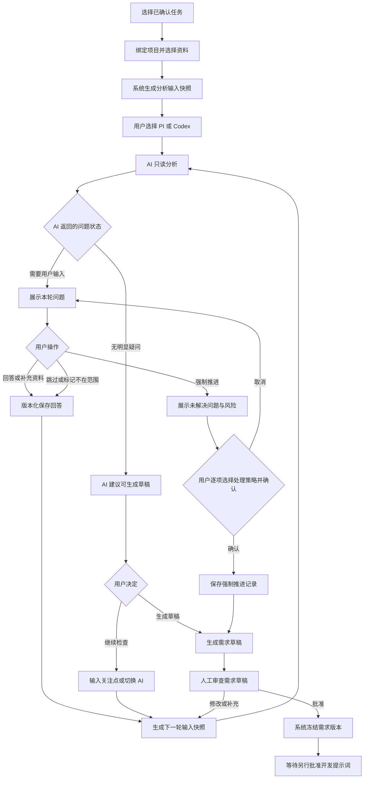
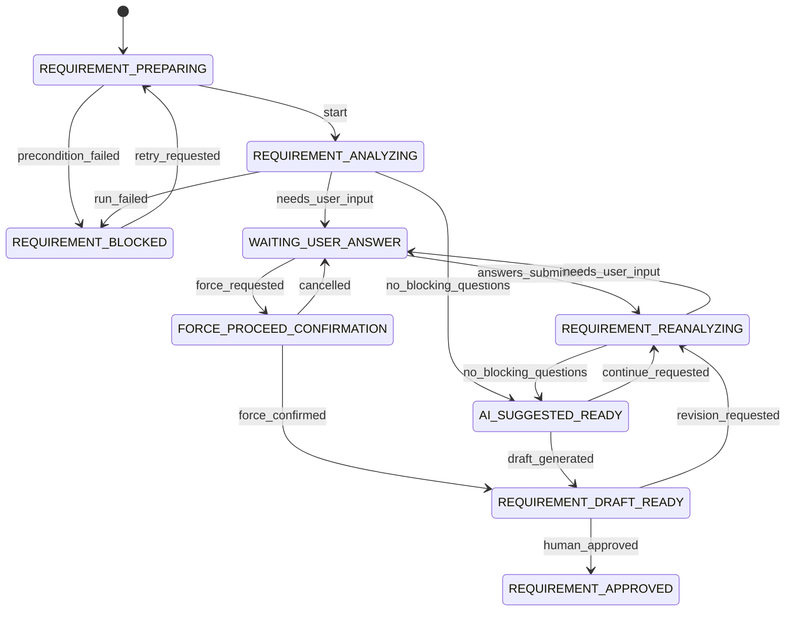

# BTaskAssistant 需求整理与 AI 访谈流程

> 状态：已确认需求 v1.0  
> 日期：2026-07-26  
> 关联架构：[SOFTWARE_ARCHITECTURE.md](./SOFTWARE_ARCHITECTURE.md)  
> 适用范围：桌面客户端的需求整理、需求访谈、需求草稿与人工批准流程

## 1. 文档目的

本文定义 BTaskAssistant 中“需求整理”阶段的正式产品流程与实现契约。该阶段由 AI 基于任务资料和项目现状发现信息缺口，通过多轮提问帮助用户明确需求，并最终生成可人工审查的需求版本。

本流程的职责边界是：

- AI 负责读取被授权的上下文、发现问题、提出问题和整理候选内容。
- 用户负责回答、排除范围、承担强制推进风险并批准正式需求。
- 系统负责权限、状态、版本、来源追踪、审计和状态守卫。

AI 可以建议“当前信息已经足够”，但无权批准需求、启动开发或把任务标记为完成。

## 2. 已确认原则

1. **系统控制流程。** 状态转换和审批守卫由 Go 领域与应用层执行，不能由模型输出直接驱动。
2. **AI 只生成候选结果。** AI 返回的问题、事实、限制和验收标准在人工确认前均不是正式需求。
3. **需求事实必须有来源。** 来源可以是资料片段、用户回答或用户明确确认的项目现状。
4. **项目观察与用户需求分离。** “项目当前怎样实现”不能自动变成“本次必须保持或修改什么”。
5. **用户可以强制推进。** 强制推进只绕过 AI 的“建议继续访谈”，不会形成 AI 审批，也不会隐藏未解决问题。
6. **正式需求必须人工批准。** 即使 AI 判断没有疑问，也只能进入等待人工确认的状态。
7. **执行器可替换。** 内置 PI 和外接 Codex 通过统一执行器契约参与流程，上层审批规则不能因执行器不同而变化。
8. **需求阶段只读。** AI 可以读取用户授权的项目内容和资料，不得修改项目代码、配置、依赖或 Git 状态。
9. **批准版本不可变。** 新资料、新回答或任何内容修改都必须生成新版本；旧版本及其审批记录保留。
10. **新增资料不静默改变结果。** 用户必须显式选择“使用新资料重新分析”。

## 3. 前置条件与分析输入包

### 3.1 开始条件

开始需求访谈前必须满足：

- 任务已经人工确认，不再是未经审查的候选任务。
- 任务已绑定一个明确的 `Project`。
- 至少一份 `READY` 资料被人工允许参与分析。
- 项目路径可读，或用户明确选择只根据资料进行分析。
- 当前没有另一个正在写入同一需求会话的运行。

任何条件不满足时，系统不得调用 AI，应返回可操作的阻塞原因。

### 3.2 固定输入包

每轮分析由系统生成不可变输入快照。AI 不得自行读取任务下全部资料或拼接未授权聊天历史。

```yaml
schema_version: 1
session_id: RS-001
task:
  id: TASK-001
  title: 购买记录页面样式对齐
  original_description: "..."
project:
  id: PROJECT-001
  name: Y16-app
  root_path: /projects/Y16-app
  baseline_revision: abc123
  rules:
    - 不修改无关模块
  approved_context:
    - path: lib/order/widgets/order_status.dart
      content_hash: sha256:...
materials:
  - material_id: MATERIAL-001
    relationship: PRIMARY_SOURCE
    version: 2
    fragments:
      - id: FRAGMENT-001
        content: "..."
        source_location: message-12
previous_answers:
  - question_id: QUESTION-001
    answer_revision_id: ANSWER-002
existing_draft_revision_id: REQ-DRAFT-002
analysis_policy:
  allow_project_read: true
  allow_code_write: false
  allow_requirement_assumption: false
  require_source_for_every_fact: true
  max_questions_per_round: 5
```

输入包必须记录项目基线、资料版本和内容哈希，使“沿用现有行为”等回答可以回溯到当时的项目状态。

## 4. 角色与权限

| 动作 | 用户 | 系统 | AI（PI/Codex） |
| --- | --- | --- | --- |
| 选择任务、项目和资料 | 决定 | 校验并保存 | 可推荐，不可决定 |
| 读取授权资料和项目 | 授权 | 构建只读输入 | 执行只读分析 |
| 提出需求问题 | 可主动补充 | 保存与去重 | 生成候选问题 |
| 回答问题 | 决定 | 版本化保存 | 不得代答 |
| 判断是否还有疑问 | 可要求继续 | 记录建议状态 | 仅可给出建议 |
| 强制推进 | 发起并确认风险 | 校验、审计、转换状态 | 不得阻止或代为确认 |
| 生成需求草稿 | 发起或确认 | 固定输入并保存版本 | 生成候选草稿 |
| 批准需求 | 唯一决定者 | 执行守卫与冻结 | 无权批准 |
| 启动开发 | 另行人工授权 | 校验批准版本 | 无权自动启动 |

## 5. 完整流程



## 6. 需求访谈状态机

### 6.1 子状态

| 状态 | 含义 |
| --- | --- |
| `REQUIREMENT_PREPARING` | 正在校验任务、项目、资料和执行器 |
| `REQUIREMENT_ANALYZING` | AI 正在分析输入快照 |
| `WAITING_USER_ANSWER` | 已产生问题，等待用户回答 |
| `REQUIREMENT_REANALYZING` | 根据新回答或新资料继续分析 |
| `AI_SUGGESTED_READY` | AI 判断没有阻塞性缺口，等待用户决定 |
| `FORCE_PROCEED_CONFIRMATION` | 用户已发起强制推进，等待风险确认 |
| `REQUIREMENT_DRAFT_READY` | 草稿已生成，等待人工审查 |
| `REQUIREMENT_APPROVED` | 需求版本已由人工批准并冻结 |
| `REQUIREMENT_BLOCKED` | 执行器、项目或资料导致流程无法继续 |
| `REQUIREMENT_CANCELLED` | 用户取消当前会话 |

### 6.2 状态图



### 6.3 与任务主状态的映射

本状态机是 `Task` 主状态机中需求阶段的细化，不替换 [SOFTWARE_ARCHITECTURE.md](./SOFTWARE_ARCHITECTURE.md) 的主状态：

- 准备、分析、问答和重分析映射到主状态 `ANALYZING`。
- `AI_SUGGESTED_READY`、强制推进确认和草稿审查映射到主状态 `WAITING_CONFIRMATION`。
- 人工批准后映射到主状态 `REQUIREMENT_APPROVED`。
- 子状态阻塞映射到主状态 `BLOCKED`，但保留会话恢复信息。

## 7. AI 提问循环

### 7.1 AI 每轮输出

AI 必须返回可校验的结构化结果，不能只返回自然语言总结。

```yaml
schema_version: 1
analysis_id: ANALYSIS-005
round: 3
analysis_status: NEEDS_USER_INPUT
confirmed_facts:
  - id: FACT-001
    content: "..."
    source_refs:
      - type: MATERIAL_FRAGMENT
        id: FRAGMENT-001
project_observations:
  - id: OBS-001
    content: "列表页和详情页共用状态组件"
    evidence:
      path: lib/order/widgets/order_status.dart
      baseline_revision: abc123
questions:
  - client_key: scope-shared-component
    category: SCOPE
    severity: BLOCKING
    question: 修改范围是否包含详情页？
    reason: 列表页和详情页共用组件，答案会改变修改范围。
    answer_type: SINGLE_SELECT
    options:
      - 只修改列表页
      - 列表页和详情页都修改
    source_refs:
      - type: PROJECT_OBSERVATION
        id: OBS-001
conflicts: []
recommended_action: ASK_QUESTIONS
```

允许的 `analysis_status`：

- `NEEDS_USER_INPUT`
- `NO_BLOCKING_QUESTIONS`
- `READY_FOR_DRAFT`
- `INSUFFICIENT_MATERIALS`
- `PROJECT_UNAVAILABLE`
- `ANALYSIS_FAILED`

系统必须进行 schema 校验。无效输出保存为原始运行产物，当前轮次标记失败，不得据此推进状态。

### 7.2 问题级别

| 级别 | 定义 | 默认行为 |
| --- | --- | --- |
| `BLOCKING` | 不回答会影响核心行为、范围或可验收结果 | 默认阻止普通推进 |
| `IMPORTANT` | 可继续，但可能影响体验或实现选择 | 允许跳过并记录风险 |
| `OPTIONAL` | 优化或非核心细节 | 不阻止进入草稿阶段 |

### 7.3 问题约束

每个问题必须：

- 说明不回答会影响什么。
- 引用触发问题的资料、回答、冲突或项目证据。
- 不能通过继续只读检查项目直接解决。
- 不重复已回答、已拒绝或语义等价的问题。
- 不把行业惯例或模型偏好包装成需求。

每轮默认最多显示 5 个问题，并优先显示 `BLOCKING`。新问题只能由新回答、新资料、项目证据或已识别冲突触发。

### 7.4 用户回答

支持以下回答方式：

- 文本、单选、多选、布尔值。
- 上传文件或图片，或引用已有资料片段。
- 引用项目文件。
- 明确选择“保持项目当前行为”；系统同时保存基线 revision 和行为证据。
- `SKIPPED`：暂时跳过，问题仍为开放状态。
- `OUT_OF_SCOPE`：明确排除，AI 不得继续围绕该问题扩展需求。

回答采用追加版本，不覆盖历史回答。用户修改回答时，新建 `RequirementAnswerRevision` 并使旧版本失效。

### 7.5 AI 判断没有疑问

AI 返回 `NO_BLOCKING_QUESTIONS` 或 `READY_FOR_DRAFT` 时，还必须提供：

- 已确认事实、限制和验收标准数量。
- 剩余 `BLOCKING`、`IMPORTANT`、`OPTIONAL` 数量。
- 未解决冲突。
- 建议结束访谈的理由。

系统只能进入 `AI_SUGGESTED_READY`。用户仍可继续补充、指定角度复查、切换执行器或生成草稿。

## 8. 用户强制推进

### 8.1 语义

“强制进入下一步”表示用户不等待 AI 判断信息完整，主动结束本轮访谈并进入需求草稿审查。它不是需求批准，也不是允许 AI 猜测答案。

### 8.2 确认流程

系统必须展示所有未解决问题、级别、影响和已有证据。用户必须对每一项选择处理策略：

| 策略 | 含义 | 写入执行约束 |
| --- | --- | --- |
| `KEEP_UNRESOLVED` | 保持未确认 | 执行遇到相关内容时停止并请求确认 |
| `FOLLOW_EXISTING_BEHAVIOR` | 明确沿用基线项目行为 | 固定项目 revision 与证据 |
| `TEMPORARY_USER_DECISION` | 用户给出本次临时决定 | 作为用户回答保存 |
| `EXCLUDE_DEPENDENT_SCOPE` | 排除依赖该答案的范围 | 写入非目标和禁止范围 |

确认记录必须包括用户、时间、问题快照、处理策略、风险摘要和并发版本号。

### 8.3 审批守卫

通常情况下，开放的 `BLOCKING` 问题禁止批准需求。用户完成强制推进后，可以人工批准，但必须满足：

```text
force_proceed_confirmed = true
AND every_open_question_has_a_user_decision = true
AND draft_contains_unresolved_items_and_execution_rules = true
AND approval_is_an_explicit_separate_user_action = true
```

此时批准结果标记为 `APPROVED_WITH_RISKS`，而不是伪装成所有问题已解决。对应开发提示词和执行输入包必须完整携带未确认事项与停止条件。

这是 [SOFTWARE_ARCHITECTURE.md](./SOFTWARE_ARCHITECTURE.md) 中“存在阻塞问题时禁止批准”的唯一人工覆盖路径；实现时必须作为独立命令和独立守卫处理，不能放宽普通批准规则。

### 8.4 禁止行为

- AI 不得自动选择处理策略。
- 系统不得因为用户打开确认页就视为已确认。
- 强制推进不得把 `KEEP_UNRESOLVED` 问题改成已回答。
- 草稿不得省略未解决问题、风险和执行规则。
- 后续开发执行器不得自行决定未确认行为。

## 9. PI/Codex 统一适配器

需求访谈使用现有 `Executor` 抽象，并通过显式能力声明选择可用执行器。

```go
type ExecutorCapability string

const CapabilityRequirementAnalysis ExecutorCapability = "requirement-analysis"

type Executor interface {
    Kind() ExecutorKind
    Capabilities(ctx context.Context) ([]ExecutorCapability, error)
    CheckAvailability(ctx context.Context) Availability
    Start(ctx context.Context, request RunRequest, sink EventSink) (RunHandle, error)
    Send(ctx context.Context, runID string, message RunMessage) error
    Cancel(ctx context.Context, runID string) error
    Resume(ctx context.Context, runID string, sink EventSink) (RunHandle, error)
    CollectArtifacts(ctx context.Context, runID string) (RunArtifacts, error)
}
```

`RunRequest` 在本阶段必须包含：

- `phase = REQUIREMENT_ANALYSIS`
- 输入快照 ID，而不是任意聊天拼接。
- 只读工作目录与工具策略。
- 结构化输出 schema 版本。
- 会话与轮次 ID。
- 明确禁用写文件和子 Agent。

实现要求：

- `OMPExecutor` 使用 OMP RPC，不模拟终端输入。
- `CodexExecutor` 封装 Codex 的会话、权限、流式事件与输出解析。
- 两者输出先转换成统一 `RequirementAnalysisResult`，领域层不识别执行器私有格式。
- 切换执行器时传递结构化输入快照、已确认事实、回答和开放问题，不传递旧 AI 的隐式推理。
- 复查执行器只能发现遗漏、冲突和无来源内容，不能改写用户回答。

## 10. 数据模型

### 10.1 核心实体

```text
Task
└── RequirementSession
    ├── RequirementContextSnapshot
    ├── RequirementAnalysisRound
    ├── RequirementQuestion
    │   └── RequirementAnswerRevision
    ├── ForceProceedRecord
    │   └── ForceProceedDecision
    └── RequirementRevision
        ├── RequirementFact
        ├── RequirementApproval
        └── UnresolvedRequirementItem
```

### 10.2 关键字段

```yaml
RequirementSession:
  id: string
  task_id: string
  status: RequirementSessionStatus
  active_executor: ExecutorKind
  current_round: integer
  version: integer
  created_at: timestamp
  updated_at: timestamp

RequirementContextSnapshot:
  id: string
  session_id: string
  project_id: string
  project_revision: string
  material_versions: json
  answer_revision_ids: json
  policy: json
  content_hash: string

RequirementQuestion:
  id: string
  session_id: string
  round_id: string
  semantic_key: string
  category: string
  severity: BLOCKING | IMPORTANT | OPTIONAL
  question: string
  reason: string
  answer_type: string
  options: json
  source_refs: json
  status: OPEN | ANSWERED | SKIPPED | OUT_OF_SCOPE | SUPERSEDED

ForceProceedRecord:
  id: string
  session_id: string
  session_version: integer
  risk_summary: string
  confirmed_by: string
  confirmed_at: timestamp

RequirementRevision:
  id: string
  task_id: string
  session_id: string
  version: integer
  status: DRAFT | APPROVED | APPROVED_WITH_RISKS | SUPERSEDED
  content: text
  source_snapshot_id: string
  approved_by: string?
  approved_at: timestamp?
```

所有状态变化同时追加 `TaskEvent`；批准和状态变更必须处于同一 SQLite 事务。版本字段用于乐观锁，避免旧页面覆盖新回答或旧草稿被误批准。

## 11. 应用服务与 Bridge API

```go
PrepareRequirementSession(taskID string) (RequirementSession, error)

StartRequirementAnalysis(
    sessionID string,
    executor ExecutorKind,
    expectedVersion int,
) (ExecutionRun, error)

SubmitRequirementAnswers(
    sessionID string,
    answers []QuestionAnswerCommand,
    expectedVersion int,
) (ExecutionRun, error)

RequestAdditionalReview(
    sessionID string,
    focus string,
    executor *ExecutorKind,
    expectedVersion int,
) (ExecutionRun, error)

RequestForceProceed(
    sessionID string,
    expectedVersion int,
) (ForceProceedSummary, error)

ConfirmForceProceed(
    sessionID string,
    decisions []ForceProceedDecisionCommand,
    expectedVersion int,
) (RequirementRevision, error)

GenerateRequirementDraft(
    sessionID string,
    expectedVersion int,
) (RequirementRevision, error)

ApproveRequirementRevision(
    revisionID string,
    expectedVersion int,
    acknowledgeRisks bool,
) error

CancelRequirementRun(runID string) error
ResumeRequirementSession(sessionID string) (RequirementSession, error)
```

API 要求：

- 所有写操作携带 `expectedVersion`。
- 重复提交使用命令 ID 保证幂等。
- 应用服务校验状态守卫，前端按钮禁用不能替代后端校验。
- AI 运行结束只保存分析结果；由应用服务根据结果执行允许的状态转换。
- 取消或崩溃不得丢失已提交回答和已完成轮次。

### 11.1 前端事件

```ts
type RequirementEvent =
  | { type: "requirement.session_updated"; sessionId: string; version: number }
  | { type: "requirement.run_started"; sessionId: string; runId: string; executor: string }
  | { type: "requirement.run_output"; runId: string; text: string }
  | { type: "requirement.questions_ready"; sessionId: string; round: number }
  | { type: "requirement.force_confirmation_required"; sessionId: string }
  | { type: "requirement.draft_ready"; sessionId: string; revisionId: string }
  | { type: "requirement.run_failed"; sessionId: string; runId: string; code: string };
```

事件仅用于实时提示。UI 重连后必须通过查询 API 恢复最终状态。

## 12. UI 设计

需求整理工作区采用三栏布局：

### 12.1 左栏：上下文

- 当前任务与所属项目。
- 已允许参与分析的资料和版本。
- 项目基线与相关文件证据。
- 已确认事实、已排除范围和资料变更提示。
- “使用新资料重新分析”入口。

### 12.2 中栏：AI 访谈

- 当前执行器、运行状态和轮次。
- 按级别排序的问题卡片。
- 问题原因、来源和项目证据。
- 回答、引用资料、跳过、排除范围操作。
- “继续分析”“指定角度复查”“切换 AI”“强制进入下一步”按钮。
- 取消、失败重试和会话恢复入口。

### 12.3 右栏：实时草稿

- 已确认需求。
- 项目观察。
- 限制与非目标。
- 候选验收标准。
- 开放问题、冲突和风险。
- 草稿版本与是否可批准的明确提示。

实时草稿不是正式版本。只有 `RequirementRevision` 被人工批准后，UI 才显示“已冻结”。

### 12.4 强制推进确认页

确认页必须显示未解决问题总数、按级别统计、逐项处理策略、将写入开发阶段的停止规则，以及独立的风险确认复选框。主按钮文案不得使用含糊的“完成”，应为“确认风险并生成需求草稿”。

## 13. 失败、恢复与安全

- 分析失败保存错误码、执行器、轮次、输入快照和原始输出，允许在同一快照上重试。
- 项目不可读或执行器不可用时进入 `REQUIREMENT_BLOCKED`，不丢失会话。
- 应用重启时，已不存在的运行标记为 `INTERRUPTED`，由用户决定恢复或重跑。
- AI 输出中的路径不能扩大系统授予的项目读取范围。
- 需求阶段不提供写文件工具，不允许 Git、依赖或数据库变更。
- 发送给外部 AI 的资料必须是用户批准的输入快照；日志在持久化前脱敏。
- 切换 AI 不自动发送旧 AI 的完整聊天或隐式推理。

## 14. 验收标准

1. 用户可以从已确认任务创建需求会话，并选择 PI 或 Codex。
2. 未绑定项目或没有获准资料时，后端拒绝开始分析并返回明确原因。
3. 每轮 AI 分析使用可审计的固定输入快照。
4. 需求阶段的执行器没有项目写权限。
5. AI 输出经过 schema 校验，无效输出不能推进状态。
6. 问题具有级别、原因、回答类型和来源证据。
7. 每轮默认最多展示 5 个问题，并优先阻塞问题。
8. 已回答或被排除的问题不会在后续轮次重复出现。
9. 用户可以通过文本、选项、资料或项目证据回答问题。
10. “保持现有行为”会保存项目基线和行为快照。
11. 回答修改会创建新版本，不覆盖历史。
12. AI 判断没有问题时只能进入 `AI_SUGGESTED_READY`，不能自动批准需求。
13. 用户可以要求继续分析、指定复查角度或切换 AI。
14. 切换 AI 使用结构化上下文，不依赖旧 AI 的隐式推理。
15. 用户可以在有开放问题时发起强制推进。
16. 强制推进前必须展示全部开放问题、影响与风险。
17. 用户必须为每个开放问题选择明确处理策略。
18. 强制推进不会把未回答问题伪装为已回答。
19. 强制推进后生成的草稿包含未确认事项、风险和开发停止规则。
20. 批准带风险需求需要独立人工操作和明确风险确认。
21. PI、Codex 或任意 AI 都无权调用批准操作。
22. 批准后的需求版本不可修改；后续变化生成新版本。
23. 新资料不会静默改变已批准需求。
24. 执行器失败、取消或应用重启后，已保存回答和轮次仍可恢复。
25. UI 漏掉实时事件后可以通过查询 API 恢复正确状态。
26. 状态机、普通推进守卫、强制推进守卫和乐观锁均有 Go 单元测试。
27. Bridge Mock 下覆盖提问、回答、AI 建议完成、强制推进和人工批准的前端测试。
28. 至少一个端到端测试证明 AI 返回“就绪”后仍不能自动批准需求。
29. 至少一个端到端测试证明带开放阻塞问题的强制推进会保留风险与停止规则。
30. 上层审批行为对 PI 与 Codex 保持一致。

## 15. 分阶段实施要求

每个阶段必须独立验证并由人工审查，不得自动进入下一阶段。

### 阶段 1：领域契约与状态机

- 定义枚举、实体、状态转换、普通推进与强制推进守卫。
- 定义结构化输入/输出 schema 和执行器能力契约。
- 使用纯 Go 单元测试覆盖允许与拒绝的转换。
- 不接真实 AI，不做 UI。

完成条件：状态机、审批边界和强制推进语义可以在无基础设施依赖下验证。

### 阶段 2：SQLite 持久化与应用服务

- 增加会话、快照、轮次、问题、回答、强制推进和需求版本存储。
- 实现事务、事件追加、幂等命令和乐观锁。
- 实现第 11 节应用服务并提供集成测试。
- 不接真实 AI。

完成条件：使用 Mock Repository 或临时 SQLite 可以完整运行问答与审批流程。

### 阶段 3：统一执行器与 Mock 分析器

- 扩展 `Executor` 的需求分析能力。
- 实现统一结果转换、schema 校验、取消和恢复。
- 先使用确定性的 Mock Executor 驱动多轮问答测试。
- 验证上层逻辑不依赖 PI/Codex 私有输出。

完成条件：Mock 环境下可完成普通流程、强制推进、切换执行器和失败恢复。

### 阶段 4：Wails Bridge、事件与前端工作区

- 暴露类型化 Bridge API 与运行事件。
- 实现三栏需求工作区、问题卡片、实时草稿和强制推进确认页。
- 使用 `MockAppBridge` 完成组件和交互测试。
- 前端不得自行推进主状态。

完成条件：浏览器 Mock 与 Wails 开发模式都能演示完整人工控制流程。

### 阶段 5：PI 与 Codex 真实适配器

- 接入 OMP RPC 需求分析会话。
- 接入 Codex 外部适配器，并映射到相同内部协议。
- 固定只读权限、工作目录和结构化输出要求。
- 添加协议录制回放、无效输出、取消和崩溃恢复测试。

完成条件：两种执行器均通过相同契约测试，审批行为无差异。

### 阶段 6：端到端与稳定性

- 覆盖完整多轮访谈、AI 建议完成、强制推进、带风险审批和新资料重分析。
- 覆盖应用重启、事件丢失、执行器不可用和并发版本冲突。
- 审计权限、日志脱敏和项目读取边界。

完成条件：第 14 节验收标准有明确自动化或人工验证记录。

## 16. 明确不做

- 不让 AI 自动批准需求、提示词、开发或任务完成。
- 不在需求访谈阶段修改业务代码。
- 不默认并行多个 Agent 共同推断需求。
- 不把 AI 置信度当作审批依据。
- 不因为执行器切换而复制一套状态机或数据模型。
- 不在本流程中实现资料解析、开发执行、代码审查或自动修复的完整功能；只定义与它们的边界。
- 不新增未经评审的生产依赖，不进行与需求访谈无关的架构重构。

## 17. 进入开发提示词阶段的条件

只有以下条件全部满足，系统才允许进入开发提示词生成：

```text
requirement_revision.status IN (APPROVED, APPROVED_WITH_RISKS)
AND requirement_revision.approved_by IS NOT NULL
AND requirement_revision.source_snapshot_id IS NOT NULL
AND all_open_questions_have_recorded_execution_rules = true
AND no_newer_unreviewed_context_snapshot_exists = true
```

满足条件仅表示“可以生成并等待人工批准开发提示词”，不表示已经授权开发。
