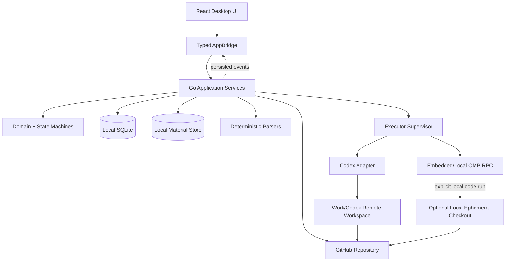

# BTaskAssistant 客户端软件架构

> 状态：架构基线 v1.0  
> 日期：2026-07-28  
> 适用范围：桌面客户端、控制面、本地资料存储和远端/临时执行集成

## 1. 架构目标

BTaskAssistant 需要同时满足：

- 本地掌握任务资料、批准版本、状态和审计记录。
- 默认不在用户电脑长期保存项目源码。
- 可在 GitHub 关联的 Work/Codex 环境中按固定 SHA 开发。
- 可嵌入 PI/OMP，并可替换为 Codex 或后续执行器。
- 用普通程序强制权限、状态、版本、幂等和恢复。
- UI 可流式显示过程，但不能成为业务真相。

## 2. 参考客户端与技术栈

本项目参考 [DeepSeek-Reasonix `main-v2`](https://github.com/esengine/DeepSeek-Reasonix/tree/main-v2) 的客户端结构，不复制其业务模型。2026-07-28 核验的参考事实：

- [`desktop/wails.json`](https://github.com/esengine/DeepSeek-Reasonix/blob/main-v2/desktop/wails.json) 使用 Wails v2，并用 pnpm 驱动前端。
- [`desktop/main.go`](https://github.com/esengine/DeepSeek-Reasonix/blob/main-v2/desktop/main.go) 把 Go 控制器直接绑定到 Wails，无额外本地 HTTP 跳转，并通过运行时事件输出。
- [`desktop/frontend/package.json`](https://github.com/esengine/DeepSeek-Reasonix/blob/main-v2/desktop/frontend/package.json) 使用 React 19、TypeScript、Vite、Zustand 与 TanStack Virtual。
- [`desktop/frontend/src/lib/bridge.ts`](https://github.com/esengine/DeepSeek-Reasonix/blob/main-v2/desktop/frontend/src/lib/bridge.ts) 将 Wails 绑定封装为单一 bridge，并为浏览器开发提供同契约 Mock。

BTaskAssistant 选择：

| 层级 | 技术方向 | 用途 |
| --- | --- | --- |
| 桌面壳 | Wails v2 | macOS、Windows、Linux 原生 WebView 客户端 |
| 内核 | Go | 领域状态机、应用服务、SQLite、文件、进程、GitHub 与执行器适配 |
| UI | React 19 + TypeScript | 任务、资料、访谈、运行和审查工作区 |
| 构建 | Vite + pnpm | 前端开发、类型检查和构建 |
| UI 状态 | Zustand | 只管理交互、筛选、流式缓存和弹层 |
| 长列表 | TanStack Virtual（确有需要时） | 资料片段、事件和日志虚拟化 |
| 本地数据 | SQLite + 内容寻址文件存储 | 业务记录与原始资料/产物 |
| 执行器 | OMP RPC、Codex app-server/exec、人工适配器 | 分阶段 AI 执行 |
| 源码真相 | GitHub | 长期源码、分支、提交与 PR |

具体依赖版本在实现任务中固定并验证；不要因为参考项目当前版本而自动复制全部依赖。

## 3. 控制面与执行面



### 3.1 本地控制面

桌面客户端长期保存：

- 任务、资料、需求、提示词、批准、事件和设置。
- 原始文档、图片、解析结果、缩略图和导出物。
- 远端仓库标识、固定 SHA、路径证据、diff、提交/PR 链接。
- 执行事件、日志、测试结果和必要运行产物。

### 3.2 执行面

执行位置与执行器是两个独立维度：

- `REMOTE_WORKSPACE`：默认；GitHub 关联的 Work/Codex 或受控远端运行器临时检出。
- `LOCAL_EPHEMERAL`：仅用户显式选择；OS 临时目录中的一次性检出。
- `EXISTING_LOCAL`：引用用户已有代码目录，不由应用复制或持有。
- `MANUAL_HANDOFF`：没有稳定可编程远端接口时，生成输入包并由用户交给外部 Work/Codex，随后导入结果。

`OMPExecutor`、`CodexExecutor`、`ManualExecutor` 均可在其支持的执行位置运行。领域层不得通过执行器品牌推断权限。

## 4. 分层

1. **表现层**：React 页面、组件和无业务权威的 UI store。
2. **桥接层**：Wails 绑定、事件订阅和 `MockAppBridge`。
3. **应用层**：用例、事务、幂等、授权和状态编排。
4. **领域层**：Task、Material、Requirement、Prompt、Run、Review 及纯守卫。
5. **基础设施层**：SQLite、文件、解析器、GitHub、凭据、执行器和 OS。

依赖方向从外向内。领域层不能依赖 Wails、SQLite、GitHub、OMP 或 Codex 私有类型。

## 5. Go 应用模块

| 模块 | 职责 |
| --- | --- |
| `task` | 主状态、命令、守卫和事件 |
| `material` | 原件、版本、处理作业、片段、候选和关系 |
| `requirement` | 会话、快照、问答、草稿、强制推进和批准 |
| `prompt` | 从批准需求生成、版本化和批准提示词 |
| `execution` | 冻结输入包、运行、事件、产物、取消和恢复 |
| `review` | 审查轮次、finding、用户决策和修复授权 |
| `project` | GitHub 仓库、基准、规则、命令和执行位置 |
| `sync` | 外部来源导入、状态映射和显式回写 |

跨聚合操作由应用服务和事务协调，不能让仓库适配器直接改业务状态。

## 6. 源码访问生命周期

### 6.1 默认远端

1. 用户选择 GitHub 仓库、分支或 SHA。
2. 系统冻结 `ProjectSnapshot`。
3. 远端环境在隔离容器检出指定基准。
4. 执行器只获得 `ExecutionPackage` 允许的路径和工具。
5. 运行返回 diff、提交、验证和产物引用。
6. 用户审查后显式决定提交、PR、合并或保留。

### 6.2 本地临时例外

- 临时目录必须位于 OS temp，不得在 `BTaskAssistantData/`。
- 记录创建时间、基准 SHA、PID/远端运行 ID、TTL 和清理状态。
- 运行结束先保存获准产物，再删除检出；清理失败进入诊断队列并通知用户。
- 不自动删除用户已有目录，不自动删除尚未提交或未导出的唯一改动。

## 7. 主进程与子进程

Wails 启动的 Go 主进程负责窗口、数据初始化、文件导入、运行恢复、执行器监督和事件广播。

可能的子进程：

```text
BTaskAssistant
├── deterministic parser worker
├── omp --mode rpc (separate session per phase)
├── codex app-server (rich local integration, when selected)
└── codex exec (bounded non-interactive run, when selected)
```

不得通过模拟终端键盘或解析彩色 TUI 集成 OMP/Codex。进程拥有独立 stdin/stdout/stderr、取消上下文、超时、会话 ID、权限配置和日志。

## 8. 数据与文件存储

```text
BTaskAssistantData/
├── database/btask.db
├── materials/objects/<sha256>
├── materials/previews/
├── runs/<run-id>/
│   ├── events.jsonl
│   ├── stdout.redacted.log
│   ├── stderr.redacted.log
│   └── artifacts/
├── exports/
├── backups/
├── cleanup-ledger/
└── logs/
```

明确禁止：`BTaskAssistantData/repos/`、长期 clone、工作树或依赖缓存。资料文件先写临时文件、校验哈希后原子移动；数据库状态变化与事件同事务提交。

## 9. Bridge 与事件

React 组件只依赖 `AppBridge`，不能直接导入 Wails 生成绑定：

```ts
export interface AppBridge {
  listTasks(query: TaskQuery): Promise<TaskPage>;
  getTask(taskId: string): Promise<TaskDetail>;
  executeTaskCommand(command: TaskCommand): Promise<TaskDetail>;
  importMaterials(request: ImportMaterialsRequest): Promise<SourceMaterial[]>;
  reviewExtraction(command: ReviewExtractionCommand): Promise<void>;
  startRequirementAnalysis(command: StartAnalysisCommand): Promise<ExecutionRun>;
  submitRequirementAnswers(command: SubmitAnswersCommand): Promise<ExecutionRun>;
  startDevelopment(command: StartDevelopmentCommand): Promise<ExecutionRun>;
  startReview(command: StartReviewCommand): Promise<ReviewRound>;
  cancelRun(runId: string): Promise<void>;
}
```

后端事件示例：

```ts
type AppEvent =
  | { type: "task.updated"; taskId: string; version: number }
  | { type: "material.progress"; materialId: string; stage: string; progress?: number }
  | { type: "run.started"; runId: string; executor: string; location: string }
  | { type: "run.output"; runId: string; stream: "stdout" | "stderr"; text: string }
  | { type: "run.approval_required"; runId: string; approvalId: string }
  | { type: "run.finished"; runId: string; status: string }
  | { type: "review.updated"; reviewRoundId: string };
```

事件是实时提示，不是可靠消息队列。前端重连后查询 SQLite 恢复权威状态。

## 10. 资料处理

处理器分为：

- `MaterialParser`：确定性解析和来源定位。
- `VisionOCRAdapter`：图片或扫描页识别。
- `ExtractionEngine`：候选任务、事实、限制和问题的结构化提取。

解析器和 AI 都只生成 `MaterialFragment`/`MaterialExtraction`，不能创建正式需求。所有不可信文档、网页和 OCR 文本按数据处理，不能成为系统指令。

## 11. 执行器监督

`ExecutorSupervisor` 负责：

- 可用性和能力协商。
- 进程/远端任务创建、关联和取消。
- 事件规范化、顺序、背压与原始帧保存。
- 权限配置和审批请求转发。
- 结果 schema 校验、产物收集和终止原因。
- 应用重启后的运行对账。

详细协议见 [EXECUTOR_INTEGRATION.md](EXECUTOR_INTEGRATION.md)。

## 12. 安全与隐私

- 需求分析阶段不提供写工具。
- 开发阶段限制到临时工作区和允许路径。
- 宿主审批决定危险命令、网络、凭据和外部写操作。
- 外部 AI 只接收用户批准的输入快照；发送前提供内容和目标预览。
- 凭据使用 macOS Keychain、Windows Credential Manager 或 Linux Secret Service。
- 日志和错误持久化前脱敏，不记录模型供应商密钥或 Git token。
- HTML/SVG 预览禁用主动内容；压缩包限制大小、文件数和路径穿越。
- 远端运行记录供应商、区域（若可知）、提交 SHA、发送资料和保留策略。
- “本地优先”不能包装成“完全离线”；UI 必须明确外部传输。

## 13. 恢复与一致性

应用启动时：

1. 完成或回滚未完成迁移。
2. 查找 `RUNNING` 但无本地进程的运行。
3. 向可查询远端适配器对账；未知状态标记 `INTERRUPTED`。
4. 恢复未完成解析、上传和清理任务，但不自动重跑 AI 开发。
5. 检查过期临时检出；保护包含唯一未导出改动的目录并提示用户。

运行原始事件先落盘再规范化。状态和事件在同一事务；重复远端回调由外部事件 ID 去重。

## 14. 目标目录结构

```text
BTaskAssistant/
├── cmd/btaskassistant/main.go
├── desktop/
│   ├── app.go
│   ├── bridge/
│   ├── platform/
│   ├── wails.json
│   └── frontend/
│       ├── src/app/
│       ├── src/features/{inbox,tasks,materials,requirements,executions,reviews,projects}/
│       ├── src/bridge/
│       └── src/stores/
├── internal/
│   ├── domain/{task,material,requirement,prompt,execution,review,project}/
│   ├── application/
│   ├── infrastructure/{sqlite,filestore,parsers,executors,github,credentials,logging}/
│   └── migrations/
├── docs/
├── scripts/
├── go.mod
└── pnpm-workspace.yaml
```

这是演进目标，不是一次性脚手架要求。

## 15. 测试架构

- 领域：纯 Go 状态机、守卫、失效和版本测试。
- 应用：事务、幂等、乐观锁、事件追加和恢复测试。
- 存储：临时 SQLite 迁移、外键、唯一约束和文件原子写测试。
- 解析：金样、恶意文件、部分成功和来源定位测试。
- 执行器：协议录制回放、能力协商、无效帧、取消、超时和崩溃测试。
- 前端：Mock Bridge、状态禁用原因、三栏流程和事件重连测试。
- 端到端：人工审批边界、远端固定 SHA、本地无长期源码、审查/修复上限和最终人工完成。

## 16. 构建与发布方向

计划命令（代码建立后才能确认）：

```text
go test ./...
pnpm typecheck
pnpm test
pnpm build
wails dev
wails build
```

CI 按平台执行 Go/前端测试、迁移测试和桌面构建。签名、自动更新、遥测与具体依赖是独立待决任务，不能在脚手架阶段擅自加入。

## 17. 核心结论

BTaskAssistant 的核心是本地控制面，而不是本地源码仓库：资料和批准由用户持有，源码由 GitHub 持有，开发在获准的隔离环境运行，执行器可以替换，但状态守卫和人工最终决定永远不变。

