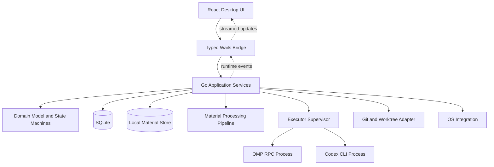
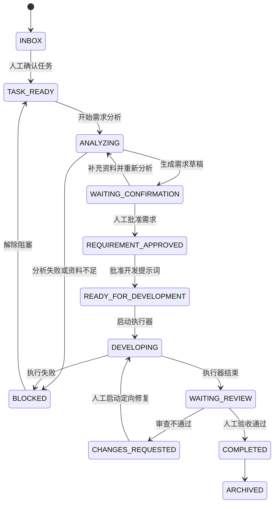
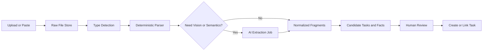

# BTaskAssistant 客户端软件架构

> 状态：架构草案 v0.1  
> 日期：2026-07-25  
> 适用范围：桌面客户端第一版及后续演进

## 1. 文档目的

BTaskAssistant 是一个面向 AI 辅助开发的本地任务工作流客户端。它负责把零散聊天、文档、图片、任务面板信息和项目代码，整理成可确认、可执行、可审查的开发任务。

本架构强调以下原则：

1. **系统控制流程，AI 只生成候选结果。**
2. **固定程序能完成的工作不调用 AI。**
3. **需求事实必须有来源，缺失和歧义必须由人工确认。**
4. **需求未批准不得开发，开发完成不得自动标记任务完成。**
5. **PI、Codex 是可替换执行器，不是工作流审批者。**
6. **客户端本地优先，用户资料和项目代码默认不经过自建云端服务。**

---

## 2. 参考项目与技术栈决策

本项目客户端技术栈参考 [DeepSeek-Reasonix](https://github.com/esengine/DeepSeek-Reasonix) 的桌面实现方式，但不复用其业务架构。

参考项目的关键设计：

- 使用 **Wails v2** 构建跨平台桌面客户端。
- 使用 **Go** 作为桌面壳、业务内核和系统能力层。
- 使用 **React + TypeScript + Vite** 构建前端。
- 前端通过 Wails 生成的绑定直接调用 Go，不额外启动本地 HTTP 服务。
- Go 通过事件向前端推送流式执行状态。
- 前端可在普通浏览器中使用 Mock Bridge 独立开发。
- 桌面壳和核心引擎分层，避免 UI 与执行引擎相互绑定。

参考文件：

- [`desktop/wails.json`](https://github.com/esengine/DeepSeek-Reasonix/blob/main-v2/desktop/wails.json)
- [`desktop/go.mod`](https://github.com/esengine/DeepSeek-Reasonix/blob/main-v2/desktop/go.mod)
- [`desktop/main.go`](https://github.com/esengine/DeepSeek-Reasonix/blob/main-v2/desktop/main.go)
- [`desktop/frontend/package.json`](https://github.com/esengine/DeepSeek-Reasonix/blob/main-v2/desktop/frontend/package.json)
- [`desktop/frontend/src/lib/bridge.ts`](https://github.com/esengine/DeepSeek-Reasonix/blob/main-v2/desktop/frontend/src/lib/bridge.ts)

### 2.1 BTaskAssistant 选定技术栈

| 层级 | 技术 | 用途 |
| --- | --- | --- |
| 桌面框架 | Wails v2 | macOS、Windows、Linux 桌面壳 |
| 后端内核 | Go | 状态机、数据库、文件处理、进程管理、Git、AI 执行器适配 |
| 前端 | React 19 + TypeScript | 桌面交互界面 |
| 构建工具 | Vite + pnpm | 前端开发和构建 |
| 前端状态 | Zustand | 页面状态、运行流、选择状态 |
| 长列表 | TanStack Virtual | 任务、日志、资料片段等长列表虚拟化 |
| 本地数据库 | SQLite | 任务、资料索引、版本、运行记录和事件日志 |
| 本地文件存储 | 文件系统内容寻址存储 | 原始文档、图片、解析产物和导出文件 |
| AI 主执行器 | oh-my-pi / OMP RPC | 需求分析、提示词生成、开发和审查 |
| AI 可选执行器 | Codex CLI 适配器 | 开发和修复执行 |
| 项目版本管理 | 系统 Git CLI | 分支、worktree、diff、提交和状态检查 |
| 日志 | Go 结构化日志 | 客户端诊断、执行器日志、崩溃恢复 |

### 2.2 暂不采用 Electron

第一版不采用 Electron，主要原因：

- Wails 可以直接复用 Go 作为业务和系统能力层。
- 不需要额外维护 Node 主进程和本地 HTTP 服务。
- 安装包和运行时占用通常更小。
- Go 更适合管理 SQLite、文件系统、Git、长时间子进程和 JSON-RPC 流。
- 与参考客户端的技术栈一致，便于借鉴其跨平台处理经验。

---

## 3. 产品边界

### 3.1 第一版目标

第一版提供完整但受控的本地工作流：

```text
资料收集
→ AI 候选提取
→ 人工创建或关联任务
→ 绑定项目
→ PI 需求分析
→ 人工确认并冻结需求
→ 生成并批准开发提示词
→ PI 或 Codex 开发
→ 人工测试或 AI 审查
→ 定向修复
→ 人工验收完成
```

### 3.2 第一版不做

以下能力不进入第一版核心范围：

- 多用户和团队权限。
- 自建云端账号和云同步。
- 移动端客户端。
- 外部任务平台双向实时同步。
- AI 自动决定需求、自动批准或自动完成任务。
- 无限制自动修复循环。
- 同一任务多个 Agent 默认并行修改代码。
- 自研通用 Agent 框架。

---

## 4. 总体架构



系统分为五层：

1. **表现层**：React 页面和组件。
2. **桥接层**：稳定、类型化的 Wails API 和事件协议。
3. **应用层**：用例编排、事务、权限检查和状态推进。
4. **领域层**：任务、资料、需求版本、执行和审查规则。
5. **基础设施层**：SQLite、文件、解析器、PI、Codex、Git 和操作系统。

依赖方向必须始终从外向内，领域层不能依赖 Wails、SQLite、PI 或 Codex。

---

## 5. 进程模型

### 5.1 主进程

BTaskAssistant 主程序是 Wails 启动的 Go 进程，负责：

- 创建桌面窗口。
- 初始化数据库和目录。
- 恢复未完成运行。
- 处理文件拖放和系统文件选择。
- 管理 PI、Codex 和解析器子进程。
- 向前端广播状态事件。
- 退出前安全停止或脱离子进程。

### 5.2 AI 子进程

AI 执行器不嵌入 UI，统一由 `ExecutorSupervisor` 管理。

```text
BTaskAssistant Go Process
├── OMP RPC Process: requirement-analysis
├── OMP RPC Process: development
├── OMP RPC Process: review
└── Codex CLI Process: optional development run
```

每个运行拥有独立：

- `execution_run_id`
- 工作目录
- 会话 ID
- 标准输入输出流
- 权限配置
- 超时与取消上下文
- 日志文件
- 状态快照

### 5.3 不使用终端模拟

PI 接入使用 OMP 的无头 RPC 模式，通过标准输入输出交换 JSON 消息和事件。不得通过模拟键盘、解析彩色终端文本或依赖终端窗口完成集成。

Codex 如果没有稳定 RPC 协议，则由独立 CLI 适配器封装，CLI 输出只能在适配层解析，不能泄漏到领域层。

---

## 6. 核心领域模型

### 6.1 主要实体

| 实体 | 作用 |
| --- | --- |
| `Project` | 本地代码项目及其执行规则 |
| `Task` | 工作流中的核心任务 |
| `SourceMaterial` | 用户上传或导入的原始资料 |
| `MaterialFragment` | 可追溯到具体位置的资料片段 |
| `TaskMaterialLink` | 任务与资料的多对多关系 |
| `RequirementRevision` | 可版本化的需求文档 |
| `PromptRevision` | 与需求版本绑定的开发提示词 |
| `ExecutionRun` | 一次 PI、Codex 或人工执行记录 |
| `ReviewRound` | 一次人工或 AI 审查记录 |
| `ReviewFinding` | 审查发现的问题 |
| `TaskEvent` | 不可变的任务操作和状态事件 |

### 6.2 聚合边界

- `Task` 是流程聚合根，只有 Task Application Service 可以推进主状态。
- `SourceMaterial` 独立管理解析状态，解析失败不得破坏任务。
- `RequirementRevision` 和 `PromptRevision` 一旦批准即不可修改。
- `ExecutionRun` 是追加式运行记录，不能覆盖历史运行。
- `ReviewRound` 引用固定的执行运行和需求版本。

---

## 7. 状态机设计

### 7.1 任务状态机



### 7.2 强制状态守卫

以下规则由 Go 代码判断，不允许 AI 决策：

```text
未绑定 Project              → 禁止开始需求分析
没有 READY 资料             → 禁止开始需求分析
存在阻塞问题                → 禁止批准需求
需求版本未批准              → 禁止批准开发提示词
开发提示词未批准            → 禁止开始开发
执行器报告完成              → 只能进入 WAITING_REVIEW
未人工验收                  → 禁止进入 COMPLETED
已批准版本内容发生变化      → 自动创建新版本并使旧提示词失效
```

### 7.3 资料状态机

```text
UPLOADED
→ PARSING
→ EXTRACTION_READY
→ WAITING_REVIEW
→ READY
```

异常状态：

- `PARTIAL_SUCCESS`
- `FAILED`
- `UNSUPPORTED`
- `ARCHIVED`
- `DELETED`

---

## 8. 资料处理架构

### 8.1 处理流水线



### 8.2 处理原则

固定程序优先处理：

- 文件类型和 MIME 检测。
- 文件哈希和重复检查。
- TXT、Markdown、JSON、YAML 文本读取。
- PDF 文本层提取。
- DOCX 段落和标题提取。
- XLSX 工作表和单元格读取。
- CSV 解析。
- HTML 正文提取。
- 页码、段落、工作表、单元格和区域定位。

AI 只处理：

- 图片和扫描文档理解。
- OCR 后的语义纠错建议。
- UI 截图、报错截图和流程图理解。
- 从长文本中提取多个候选任务。
- 候选事实、限制、验收标准和待确认问题。
- 候选项目推荐。

### 8.3 解析器接口

```go
type MaterialParser interface {
    Supports(meta MaterialMeta) bool
    Parse(ctx context.Context, input MaterialInput) (ParseResult, error)
}

type ExtractionEngine interface {
    Extract(ctx context.Context, input ExtractionInput) (ExtractionResult, error)
}
```

每个 `MaterialFragment` 必须保存来源定位信息，例如：

- PDF：页码和文本范围。
- DOCX：标题路径和段落序号。
- XLSX：工作表和单元格范围。
- 图片：矩形坐标和识别文字。
- 聊天：消息序号、发送人和时间。

AI 生成的任何事实如果没有 `source_fragment_id`，只能进入“建议”或“待确认问题”。

---

## 9. AI 执行器架构

### 9.1 统一接口

```go
type Executor interface {
    Kind() ExecutorKind
    CheckAvailability(ctx context.Context) Availability
    Start(ctx context.Context, request RunRequest, sink EventSink) (RunHandle, error)
    Send(ctx context.Context, runID string, message RunMessage) error
    Cancel(ctx context.Context, runID string) error
    Resume(ctx context.Context, runID string, sink EventSink) (RunHandle, error)
    CollectArtifacts(ctx context.Context, runID string) (RunArtifacts, error)
}
```

实现：

```text
Executor
├── OMPExecutor
├── CodexExecutor
└── ManualExecutor
```

### 9.2 OMP 适配器

`OMPExecutor` 负责：

- 启动和检测本地 OMP。
- 以 RPC 模式创建会话。
- 发送明确的 Skill 或阶段提示词。
- 解析 JSON 响应和流式事件。
- 处理结构化提问、工具审批和取消。
- 保存 OMP 会话 ID，支持恢复。
- 将 OMP 事件转换成内部统一事件。

不同阶段必须使用独立会话和工具策略：

| 阶段 | 写文件 | 运行命令 | 子 Agent | 说明 |
| --- | --- | --- | --- | --- |
| 资料提取 | 否 | 否 | 否 | 只处理已批准输入 |
| 需求分析 | 否 | 只读命令 | 否 | 严禁修改项目 |
| 提示词生成 | 否 | 否 | 否 | 只读取批准需求版本 |
| 开发 | 是 | 是 | 人工启用 | 限制在指定项目和 worktree |
| 审查 | 默认否 | 测试和 Git 命令 | 可启用 reviewer | 独立于开发会话 |
| 定向修复 | 是 | 是 | 默认否 | 只能处理已批准 Finding |

### 9.3 Codex 适配器

`CodexExecutor` 与 OMP 使用相同的 `RunRequest` 和 `RunArtifacts`，但内部独立处理：

- CLI 参数。
- 会话恢复。
- 权限模式。
- 输出解析。
- 取消信号。

上层工作流不得依据“当前执行器是 PI 还是 Codex”改变审批规则。

### 9.4 执行输入包

开发前生成不可变输入包：

```yaml
task_id: TASK-001
project_id: PROJECT-001
requirement_revision_id: REQ-003
prompt_revision_id: PROMPT-002
allowed_scope:
  - src/task/**
forbidden_scope:
  - authentication/**
acceptance_criteria:
  - AC-001
verification_commands:
  - go test ./...
executor: omp
```

执行器只能读取该版本，不得从零散聊天中重新推导需求。

---

## 10. 人工确认点

必须保留四道不可绕过的人工确认：

1. **候选任务确认**：AI 从资料提取后，人工决定新建、合并、关联或忽略。
2. **需求确认**：人工处理阻塞问题并批准固定需求版本。
3. **开发授权**：人工批准开发提示词并选择执行器。
4. **最终验收**：人工运行或确认测试后，将任务标记为完成。

AI 审查结果不能自动触发完成；自动定向修复最多执行固定轮数，默认上限为两轮，超过后进入 `BLOCKED`。

---

## 11. 本地存储架构

### 11.1 应用数据目录

```text
BTaskAssistantData/
├── database/
│   └── btask.db
├── tasks/
│   └── <task-id>/
│       ├── context.json
│       ├── files/
│       └── images/
├── materials/
│   ├── objects/<sha256>
│   └── previews/
├── runs/
│   └── <execution-run-id>/
│       ├── events.jsonl
│       ├── stdout.log
│       ├── stderr.log
│       └── artifacts/
├── exports/
├── backups/
└── logs/
```

每个任务使用稳定任务 ID 建立独立目录。当前纵向切片把完整 `Task` 聚合写入
`context.json`，将文件类来源的文本内容写入 `files/`，并将任务中的 data URL
图片按内容哈希写入 `images/`；标题或项目名称变化不重命名目录。用户也可以在
任务目录中补充其他文件和图片，应用不会自动删除这些内容。`projectPath` 只是
外部代码仓库引用，项目代码和系统凭据均不复制到任务目录。

任务资料根目录是独立的应用设置，默认位于系统用户配置目录，也可以从设置页
迁移到用户选择的新空目录。迁移复制整个目录并在切换配置前校验当前任务快照，
旧目录保留为备份。任务移入回收站、永久删除或工作区清空时，物理目录均保留为
归档，后续如需清理必须提供单独且明确的用户操作。未来拆分原始资料和执行产物
时，任务目录继续保存其完整清单和来源关系，全局内容寻址对象只承担去重存储。

原始资料采用 SHA-256 内容寻址存储：

- 数据库保存元数据和逻辑文件名。
- 相同内容默认只保存一份。
- 资料新版本创建新的内容对象。
- 已被批准需求引用的对象不可静默替换。

### 11.2 SQLite 表建议

```text
projects
project_commands
project_rules

tasks
task_events

task_material_links
source_materials
material_versions
material_fragments
material_processing_jobs
material_extractions

requirement_revisions
requirement_facts
requirement_questions
requirement_approvals

prompt_revisions
prompt_approvals

execution_runs
execution_events
execution_artifacts

review_rounds
review_findings
review_decisions

app_settings
schema_migrations
```

### 11.3 数据一致性

- 状态变更和事件写入必须处于同一个 SQLite 事务。
- 事件日志只追加，不原地修改。
- 版本批准使用乐观锁，避免 UI 打开旧版本后误批准。
- 文件先写临时路径，校验哈希后原子移动。
- 删除资料默认软删除；真正清理由垃圾回收任务完成。

---

## 12. 前端架构

### 12.1 页面结构

```text
应用框架
├── 收集箱
│   ├── 资料列表
│   ├── 文件/图片/文本预览
│   └── AI 候选提取结果
├── 任务面板
│   ├── 看板
│   ├── 列表
│   └── 搜索与筛选
├── 任务工作区
│   ├── 概览
│   ├── 资料
│   ├── 需求
│   ├── 开发提示词
│   ├── 执行
│   ├── 审查
│   └── 历史事件
├── 项目管理
├── 执行中心
└── 设置与诊断
```

### 12.2 状态划分

Zustand 只管理前端交互状态和缓存：

- 当前选中的任务和资料。
- 页面筛选条件。
- 正在流式显示的执行事件。
- 弹窗和面板状态。
- 乐观 UI 的短期状态。

以下信息必须以 Go/SQLite 为唯一真相来源：

- 任务主状态。
- 批准状态。
- 需求和提示词版本。
- 执行运行状态。
- 资料处理状态。
- 审查结果。

前端不得自行推进任务状态。

### 12.3 Bridge 模式

前端只通过单一 `AppBridge` 访问后端：

```ts
export interface AppBridge {
  listTasks(query: TaskQuery): Promise<TaskPage>;
  getTask(taskId: string): Promise<TaskDetail>;
  transitionTask(command: TransitionTaskCommand): Promise<TaskDetail>;

  importMaterials(request: ImportMaterialsRequest): Promise<SourceMaterial[]>;
  reviewExtraction(command: ReviewExtractionCommand): Promise<void>;

  startRequirementAnalysis(taskId: string): Promise<ExecutionRun>;
  approveRequirement(command: ApproveRequirementCommand): Promise<void>;
  approvePrompt(command: ApprovePromptCommand): Promise<void>;

  startDevelopment(command: StartDevelopmentCommand): Promise<ExecutionRun>;
  startReview(command: StartReviewCommand): Promise<ReviewRound>;
  cancelRun(runId: string): Promise<void>;
}
```

React 组件不能直接导入 Wails 生成代码。`WailsAppBridge` 封装真实调用，`MockAppBridge` 用于浏览器开发和前端测试。

---

## 13. 事件协议

### 13.1 后端到前端

Go 通过 Wails Runtime Events 推送统一事件：

```ts
type AppEvent =
  | { type: "task.updated"; taskId: string; revision: number }
  | { type: "material.progress"; materialId: string; progress: number; stage: string }
  | { type: "run.started"; runId: string; executor: string }
  | { type: "run.output"; runId: string; stream: "stdout" | "stderr"; text: string }
  | { type: "run.tool_call"; runId: string; toolCall: ToolCallView }
  | { type: "run.approval_required"; runId: string; approval: ApprovalView }
  | { type: "run.finished"; runId: string; status: string }
  | { type: "review.updated"; reviewRoundId: string };
```

### 13.2 事件可靠性

UI 事件不是持久化消息队列。前端重新打开或漏掉事件后，必须调用查询 API 从 SQLite 恢复最终状态。

执行器原始事件先写入运行日志，再转换并广播，保证崩溃后可以诊断。

---

## 14. 项目和 Git 管理

`Project` 保存：

- 本地目录。
- Git 仓库根目录。
- 默认分支。
- 项目说明文件。
- AGENTS.md 路径。
- 构建、测试、格式化和静态检查命令。
- 允许和禁止修改范围。
- 默认 PI/Codex 配置。

Git 适配器负责：

- 检测脏工作区。
- 创建任务分支或临时 worktree。
- 获取 diff 和变更文件。
- 检查冲突。
- 记录基准 commit。
- 在人工批准后合并或保留分支。

第一版默认每个开发运行使用独立 worktree，避免 AI 直接污染用户主工作区。用户可以在项目设置中关闭，但必须看到风险提示。

---

## 15. 安全与隐私

### 15.1 默认本地优先

- SQLite、资料、日志和执行记录保存在本机。
- 不建设 BTaskAssistant 自有云端中转服务。
- 只有用户选择的资料片段才发送给配置的模型提供方。
- 项目完整代码不能默认附加给资料提取任务。

### 15.2 密钥存储

API Key 和令牌不得写入 SQLite 明文，使用系统凭据存储：

- macOS Keychain
- Windows Credential Manager
- Linux Secret Service

### 15.3 执行权限

- 需求分析阶段不开放写文件能力。
- 开发阶段限制工作目录。
- 危险命令需要明确审批。
- 工具审批结果保存作用域：单次、当前运行或项目规则。
- 日志写入前对 API Key、Token 和常见凭据格式脱敏。

### 15.4 文件安全

- 上传文件只作为数据解析，不直接执行。
- 压缩包必须限制解压大小、文件数量和路径穿越。
- HTML 预览需要禁用脚本。
- SVG 预览需要清理外部资源和脚本。
- 图片和文档预览使用受控本地资源地址。

---

## 16. 崩溃恢复与任务恢复

### 16.1 启动恢复

应用启动时检查：

- `RUNNING` 状态但进程已不存在的 ExecutionRun。
- 未完成的资料解析任务。
- 未提交的数据库迁移。
- 临时文件和孤立 worktree。
- 上次异常退出标记。

运行状态恢复规则：

```text
进程仍存在且协议可重连 → 尝试恢复
进程不存在但会话可恢复 → 标记 PAUSED，等待人工恢复
进程不存在且不可恢复   → 标记 INTERRUPTED
```

系统不得因为重新启动就自动重复执行 AI 开发任务。

### 16.2 安全模式

连续启动崩溃时提供安全模式：

- 不自动启动 AI 子进程。
- 暂停资料后台解析。
- 禁用第三方扩展。
- 允许导出数据库、日志和诊断信息。

---

## 17. 测试架构

### 17.1 Go 测试

- 领域状态机单元测试。
- 应用服务事务测试。
- SQLite Repository 集成测试。
- 资料解析器金样测试。
- OMP/Codex 协议录制回放测试。
- 子进程取消和崩溃恢复测试。
- Git worktree 集成测试。

### 17.2 前端测试

- Bridge Mock 下的组件测试。
- 状态守卫和按钮可用性测试。
- 长列表和大量日志性能测试。
- 文件拖放、预览和候选提取交互测试。
- 任务状态更新后的缓存刷新测试。

### 17.3 端到端测试

至少覆盖：

1. 上传文档并创建候选任务。
2. 图片识别失败后人工补充。
3. 需求有阻塞问题时不能批准。
4. 批准需求后修改资料会生成新版本。
5. PI 开发完成后只能进入待审查。
6. 审查失败后创建定向修复轮次。
7. 最终只有人工操作可以完成任务。
8. 应用崩溃后恢复运行记录。

---

## 18. 构建和发布

### 18.1 开发命令建议

```text
pnpm dev            前端浏览器 Mock 开发
wails dev           完整桌面联调
go test ./...       Go 测试
pnpm typecheck      前端类型检查
pnpm test           前端测试
wails build         本地桌面构建
```

### 18.2 CI

GitHub Actions 至少包含：

- Go 格式、静态检查和测试。
- TypeScript 类型检查和前端测试。
- 数据库迁移测试。
- macOS、Windows、Linux 构建验证。
- 安装包产物和哈希生成。
- 发布版本的签名和升级清单。

### 18.3 自动更新

自动更新属于基础设施能力，不影响领域状态。更新前必须：

- 禁止正在运行的开发任务静默退出。
- 提示用户暂停或取消执行器。
- 完成数据库备份。
- 更新失败后可以回滚到旧版本。

---

## 19. 推荐目录结构

```text
BTaskAssistant/
├── cmd/
│   └── btaskassistant/
│       └── main.go
├── desktop/
│   ├── app.go
│   ├── bindings/
│   ├── platform/
│   ├── wails.json
│   └── frontend/
│       ├── package.json
│       ├── src/
│       │   ├── app/
│       │   ├── components/
│       │   ├── features/
│       │   │   ├── inbox/
│       │   │   ├── tasks/
│       │   │   ├── materials/
│       │   │   ├── requirements/
│       │   │   ├── executions/
│       │   │   ├── reviews/
│       │   │   └── projects/
│       │   ├── bridge/
│       │   ├── stores/
│       │   └── types/
│       └── vite.config.ts
├── internal/
│   ├── domain/
│   │   ├── project/
│   │   ├── task/
│   │   ├── material/
│   │   ├── requirement/
│   │   ├── execution/
│   │   └── review/
│   ├── application/
│   ├── infrastructure/
│   │   ├── sqlite/
│   │   ├── filestore/
│   │   ├── parsers/
│   │   ├── executors/
│   │   │   ├── omp/
│   │   │   ├── codex/
│   │   │   └── manual/
│   │   ├── git/
│   │   ├── credentials/
│   │   └── logging/
│   └── migrations/
├── docs/
│   ├── SOFTWARE_ARCHITECTURE.md
│   ├── PRODUCT_REQUIREMENTS.md
│   ├── DATA_MODEL.md
│   ├── OMP_RPC_INTEGRATION.md
│   └── ADR/
├── scripts/
├── go.mod
├── pnpm-workspace.yaml
└── README.md
```

---

## 20. 实施顺序

不按时间估算，按依赖顺序实施：

### 阶段一：客户端基础

- Wails 桌面壳。
- React/Vite 前端。
- Typed Bridge 和 Mock Bridge。
- SQLite、迁移和结构化日志。
- 项目注册表和基础任务状态机。

### 阶段二：资料收集

- 文件、图片、文本和聊天导入。
- 原始资料存储。
- 文档解析和资料片段。
- AI 候选提取。
- 人工创建、合并和关联任务。

### 阶段三：需求版本和审批

- RequirementRevision。
- 来源追踪。
- 阻塞问题。
- 人工批准和版本冻结。
- PromptRevision。

### 阶段四：OMP 集成

- OMP 发现和诊断。
- RPC 进程管理。
- 流式事件。
- 需求分析 Skill。
- 开发 Skill。
- 审查 Skill。

### 阶段五：开发闭环

- Git worktree。
- Codex 可选适配器。
- 执行输入包。
- 人工和 AI 审查。
- 最多两轮定向修复。
- 人工最终验收。

### 阶段六：稳定性和外部集成

- 崩溃恢复和安全模式。
- 自动更新。
- GitHub Issue 等外部来源导入。
- 外部任务状态回写。

---

## 21. 架构决策摘要

| 决策 | 结论 |
| --- | --- |
| 桌面框架 | Wails v2 |
| UI | React + TypeScript + Vite |
| 后端 | Go 单机应用内核 |
| 前后端通信 | Wails Typed Bindings + Runtime Events |
| 数据 | SQLite + 本地内容寻址文件存储 |
| 工作模式 | Local-first、单用户 |
| 主 AI 执行器 | OMP RPC |
| 可选执行器 | Codex CLI Adapter |
| AI 权限 | 按阶段显式限制 |
| 流程控制 | Go 状态机，AI 无审批权限 |
| 版本策略 | 需求、提示词、执行和审查全部保留历史 |
| 开发隔离 | 默认 Git worktree |
| 最终完成 | 只允许人工确认 |

本架构的核心不是让 Agent 自动接管开发，而是建立一套可靠的控制面：**资料可追溯、需求可冻结、执行可替换、过程可恢复、结果可审查、最终由人工决定。**
