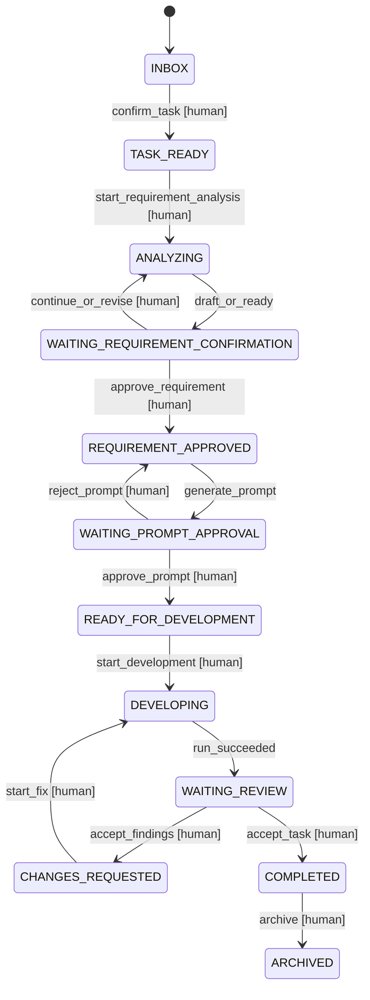
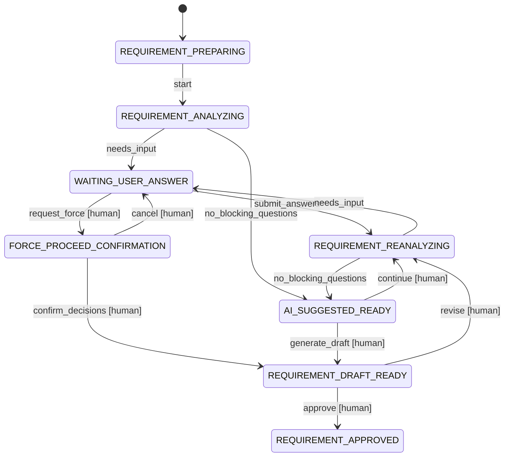
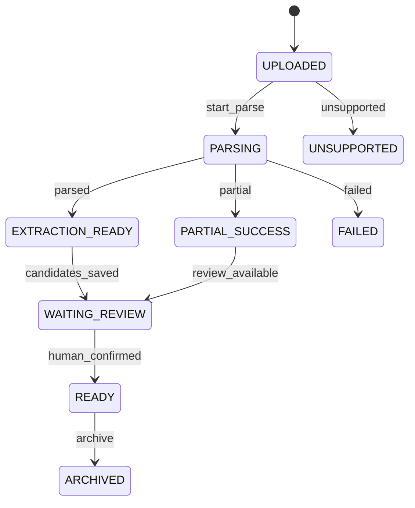

# BTaskAssistant 工作流状态机

> 状态：已确认契约 v1.0  
> 日期：2026-07-28  
> 本文是任务主状态、人工守卫和禁止转换的权威来源。

## 1. 设计原则

1. 状态只能由命令和领域守卫转换，不提供通用 `setStatus`。
2. AI、前端和外部任务平台只能提交候选结果或用户命令，不能直接写主状态。
3. 状态变化、版本引用和 `TaskEvent` 在同一事务中提交。
4. 每个命令带 `command_id` 与 `expected_version`，支持幂等和乐观锁。
5. “运行成功”“审查通过”和“任务完成”是三个不同事实。
6. 所有覆盖路径都必须显式、可审计，并且只能由用户选择。

## 2. 任务主状态

| 状态 | 含义 | 用户可见的主要动作 |
| --- | --- | --- |
| `INBOX` | 新建或导入，尚未人工确认 | 整理、关联资料、确认、归档 |
| `TASK_READY` | 标题/目标已确认，等待需求整理 | 绑定项目、选择资料、开始分析 |
| `ANALYZING` | 需求准备、AI 分析或问答进行中 | 回答、补充资料、取消、强制推进 |
| `WAITING_REQUIREMENT_CONFIRMATION` | AI 建议就绪或需求草稿待审查 | 继续分析、批准、带风险批准 |
| `REQUIREMENT_APPROVED` | 固定需求版本已人工批准 | 生成开发提示词 |
| `WAITING_PROMPT_APPROVAL` | 开发提示词草稿待人工审查 | 修改、批准、回到需求 |
| `READY_FOR_DEVELOPMENT` | 需求和提示词均已批准 | 选择执行器和工作区、开始开发 |
| `DEVELOPING` | 开发或定向修复运行中 | 查看、回答审批、取消 |
| `WAITING_REVIEW` | 开发运行结束，等待验收/审查 | 人工验收、AI 审查、提出修改 |
| `CHANGES_REQUESTED` | 用户已接受需要修复的问题 | 启动修复、调整 finding、取消 |
| `COMPLETED` | 用户已明确最终验收 | 归档、显式外部回写 |
| `BLOCKED` | 当前动作无法继续 | 处理原因、恢复到 `blocked_from_state` |
| `CANCELLED` | 用户取消任务 | 查看历史、按新命令重新打开 |
| `ARCHIVED` | 终态任务不再参与默认视图 | 恢复到此前终态 |

## 3. 主状态图



`BLOCKED`、`CANCELLED` 和 `ARCHIVED` 的通用边为避免图形噪声未全部展开。进入 `BLOCKED` 时必须保存来源状态；解除阻塞只返回该合法来源状态，不能跳过中间审批。

## 4. 命令与守卫

| 命令 | 来源状态 | 目标状态 | 必须守卫 | 允许发起者 |
| --- | --- | --- | --- | --- |
| `ConfirmTask` | `INBOX` | `TASK_READY` | 标题和原始来源存在 | 用户 |
| `StartRequirementAnalysis` | `TASK_READY`/可恢复状态 | `ANALYZING` | Project 已绑定；上下文获准；没有冲突运行 | 用户 |
| `RecordRequirementQuestions` | `ANALYZING` | `ANALYZING` | 输出 schema 合法；只能写候选问题 | 系统处理 AI 结果 |
| `MarkAISuggestedReady` | `ANALYZING` | `WAITING_REQUIREMENT_CONFIRMATION` | AI 给出统计和理由；不形成批准 | 系统 |
| `SaveRequirementDraft` | `ANALYZING`/等待确认 | `WAITING_REQUIREMENT_CONFIRMATION` | 草稿引用固定快照 | 系统 |
| `ContinueRequirementAnalysis` | 等待确认 | `ANALYZING` | 用户补充、要求复查或拒绝草稿 | 用户 |
| `ApproveRequirement` | 等待确认 | `REQUIREMENT_APPROVED` | 无开放阻塞问题/冲突；版本未过期 | 用户 |
| `ApproveRequirementWithRisks` | 等待确认 | `REQUIREMENT_APPROVED` | 强制推进完成；逐项决策；独立风险确认 | 用户 |
| `GeneratePromptDraft` | `REQUIREMENT_APPROVED` | `WAITING_PROMPT_APPROVAL` | 只读当前批准需求 | 用户或确定性模板服务 |
| `ApprovePrompt` | `WAITING_PROMPT_APPROVAL` | `READY_FOR_DEVELOPMENT` | Prompt 绑定当前批准需求且未过期 | 用户 |
| `StartDevelopment` | `READY_FOR_DEVELOPMENT` | `DEVELOPING` | ExecutionPackage 冻结；权限/基准/工作区可用 | 用户 |
| `FinishRun` | `DEVELOPING` | `WAITING_REVIEW` | 运行确认为 `SUCCEEDED`；结果 schema 合法 | 系统 |
| `AcceptReviewFindings` | `WAITING_REVIEW` | `CHANGES_REQUESTED` | finding 由用户逐项接受并限定范围 | 用户 |
| `StartFix` | `CHANGES_REQUESTED` | `DEVELOPING` | FixPackage 只含获准 finding；轮次预算可用 | 用户 |
| `AcceptTask` | `WAITING_REVIEW` | `COMPLETED` | 用户明确验收；没有未处置阻塞 finding | 用户 |
| `BlockTask` | 活跃状态 | `BLOCKED` | 保存结构化原因和来源状态 | 系统或用户 |
| `ResumeTask` | `BLOCKED` | 来源状态 | 原阻塞原因已处理；来源状态仍合法 | 用户 |
| `CancelTask` | 非终态 | `CANCELLED` | 取消活动运行并记录产物状态 | 用户 |
| `ArchiveTask` | `COMPLETED`/`CANCELLED` | `ARCHIVED` | 没有活动运行 | 用户 |

## 5. 需求访谈子状态

主状态 `ANALYZING` 与 `WAITING_REQUIREMENT_CONFIRMATION` 下维护独立 `RequirementSessionStatus`：

| 子状态 | 含义 |
| --- | --- |
| `REQUIREMENT_PREPARING` | 校验任务、项目、资料、执行器与快照 |
| `REQUIREMENT_ANALYZING` | AI 执行第一轮只读分析 |
| `WAITING_USER_ANSWER` | 问题已保存，等待用户 |
| `REQUIREMENT_REANALYZING` | 新回答/资料后的后续分析 |
| `AI_SUGGESTED_READY` | AI 判断没有阻塞性缺口 |
| `FORCE_PROCEED_CONFIRMATION` | 用户请求强制推进，等待逐项风险处理 |
| `REQUIREMENT_DRAFT_READY` | 草稿待人工审查 |
| `REQUIREMENT_APPROVED` | 当前 revision 已人工冻结 |
| `REQUIREMENT_BLOCKED` | 执行器或上下文不可用 |
| `REQUIREMENT_CANCELLED` | 会话由用户取消 |



AI 事件只能建议 `needs_input` 或 `no_blocking_questions`；应用服务在 schema 校验后执行允许的子状态转换。

## 6. 强制推进覆盖路径

普通路径中，开放 `BLOCKING` 问题会拒绝 `ApproveRequirement`。唯一覆盖路径是：

1. 用户执行 `RequestForceProceed`。
2. 系统生成当前开放问题、影响、证据和风险的固定快照。
3. 用户对每项选择 `KEEP_UNRESOLVED`、`FOLLOW_EXISTING_BEHAVIOR`、`TEMPORARY_USER_DECISION` 或 `EXCLUDE_DEPENDENT_SCOPE`。
4. 系统生成包含未决事项和执行停止条件的草稿。
5. 用户执行另一个 `ApproveRequirementWithRisks` 命令并确认风险。

该路径不能：

- 把未回答问题改成 `ANSWERED`。
- 让 AI 选择处理策略。
- 自动批准草稿。
- 省略风险或允许开发执行器自行决定。

## 7. 资料状态机



`DELETED` 是软删除标记，不应把被批准版本引用的资料物理删除。重试从原件创建新的 `MaterialProcessingJob`，不覆盖旧作业。

## 8. 执行运行状态

`ExecutionRunStatus` 与任务状态分离：

```text
QUEUED → STARTING → RUNNING → SUCCEEDED
                         ├── FAILED
                         ├── CANCELLING → CANCELLED
                         ├── WAITING_APPROVAL → RUNNING
                         └── INTERRUPTED
```

- `SUCCEEDED` 表示适配器获得了合规结果，不表示测试全部通过或任务完成。
- `WAITING_APPROVAL` 是工具调用审批，不是需求/任务审批。
- `INTERRUPTED` 由进程失联、应用重启或远端状态未知产生，需要人工恢复或重跑。
- `RunKind` 至少包括 `MATERIAL_EXTRACTION`、`REQUIREMENT_ANALYSIS`、`PROMPT_GENERATION`、`DEVELOPMENT`、`REVIEW`、`TARGETED_FIX`、`VERIFICATION`。

## 9. 审查与修复状态

```text
ReviewRound: DRAFT → RUNNING → FINDINGS_READY → WAITING_USER_DECISION
                                      ├── CLOSED_NO_ACTION
                                      ├── CHANGES_ACCEPTED
                                      └── HUMAN_ACCEPTED

FixAuthorization: PENDING → APPROVED → CONSUMED | EXPIRED | CANCELLED
```

AI 的“无 finding”不会触发 `HUMAN_ACCEPTED`。修复授权固定 finding、允许路径、验证和轮次预算；需求版本或基准变化会使其 `EXPIRED`。

## 10. 批准失效规则

以下任一变化使下游尚未开始的授权失效：

- 批准需求被 supersede。
- 参与需求的资料版本、用户回答或项目基准发生变化并被选为新上下文。
- Prompt 内容或绑定需求变化。
- 允许/禁止范围、验证命令或执行位置变化。
- 远端分支 SHA 与冻结基准不一致且用户未重新基线。

已完成运行不会被删除，但标记为基于旧版本，不能作为新版本的完成证据。

## 11. 事件与审计

每个 `TaskEvent` 至少记录：

```yaml
id: event-id
task_id: task-id
sequence: 42
event_type: requirement.approved_with_risks
actor_type: HUMAN
actor_id: local-user
command_id: command-id
from_state: WAITING_REQUIREMENT_CONFIRMATION
to_state: REQUIREMENT_APPROVED
aggregate_version: 18
references:
  requirement_revision_id: req-4
  context_snapshot_id: snapshot-7
created_at: 2026-07-28T12:00:00Z
```

事件只追加。需要更正时追加补偿/更正事件，不改写历史行。

## 12. 外部任务状态映射

| 内部状态 | 外部简化状态 |
| --- | --- |
| `INBOX`/`TASK_READY` | 待处理 |
| `ANALYZING` | 需求处理中 |
| 等待需求/提示词批准 | 等待确认 |
| `READY_FOR_DEVELOPMENT` | 待开发 |
| `DEVELOPING` | 进行中 |
| `WAITING_REVIEW` | 待验收 |
| `CHANGES_REQUESTED` | 修复中 |
| `COMPLETED` | 已完成 |
| `BLOCKED` | 阻塞 |

外部状态不能直接驱动内部批准。回写失败只记录同步错误，不回滚内部事务。

## 13. 明确禁止的转换

- `INBOX → ANALYZING`
- `ANALYZING → REQUIREMENT_APPROVED`（没有独立人工批准）
- `REQUIREMENT_APPROVED → DEVELOPING`（没有批准提示词）
- `READY_FOR_DEVELOPMENT → COMPLETED`
- `DEVELOPING → COMPLETED`
- `WAITING_REVIEW → DEVELOPING`（没有接受 finding/修复授权）
- 任何 AI 角色触发 `ApproveRequirement*`、`ApprovePrompt` 或 `AcceptTask`
- 通过修改数据库字段、前端缓存或模型返回文本绕过命令

## 14. 必测场景

1. 每条允许转换和所有禁止转换。
2. 旧 `expected_version`、重复 `command_id` 和并发批准。
3. AI 返回就绪后仍不能批准需求。
4. 开放阻塞问题使普通批准失败。
5. 强制推进未逐项决策时失败；完成后仍保留开放问题。
6. 需求版本变化使 Prompt 和执行授权失效。
7. 开发成功只能进入 `WAITING_REVIEW`。
8. AI 审查无 finding 仍不能完成任务。
9. 两轮定向修复耗尽后进入 `BLOCKED`。
10. 崩溃恢复、事件重放和外部回写失败不破坏内部状态。

